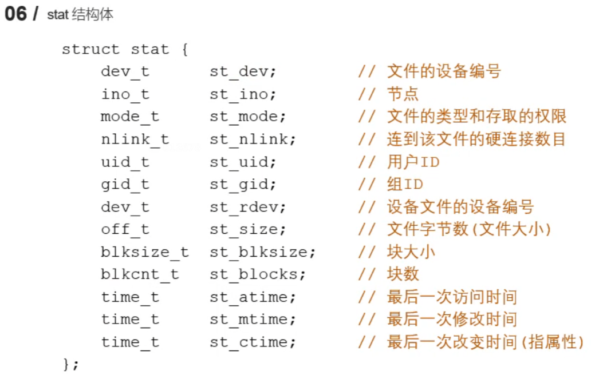

# 1. GCC

编译生成可执行文件：

```shell
gcc test.c -o test
```

运行可执行文件：
```shell
./test
```


```shell
gcc test.c -E -o test.i
gcc test.i -S -o test.s
gcc test.s -c -o test.o
```

# 2. 静态库

命名规则：libxxx.a

静态库的制作：首先通过gcc获得.o文件，再使用ar工具将它们打包。
```shell
ar rcs libxxx.a xxx.o xxx.o
```

静态库的使用：
```shell
gcc test.c -o test -l xxx
```

# 3. 动态库

命名规则：libxxx.so

动态库的制作：首先通过gcc获得.o文件，==得到和位置无关的代码==
```shell
gcc -c -fpic a.c b.c
```
再通过gcc得到动态库
```shell
gcc -shared a.o b.o -o libcalc.so
```

动态库的使用：
```shell
gcc test.c -o test -l calc
```

工作原理：对于静态库，gcc进行链接时会把静态库中代码打包到可执行程序中；而对于动态库，gcc进行链接时不会把动态库的代码打包到可执行程序中，==而是在程序启动之后，动态库才会被动态加载到内存中==，通过ldd(list dynamic dependencies)命令检查动态库依赖关系。

定位共享库文件的方法：当系统加载可执行代码时候，能够知道其所依赖的库的名字，但是还需要知道绝对路径，此时就需要系统的动态载入器来获取该绝对路径。对于elf格式的可执行程序，是由ld-linux.so来完成的，它先后搜索elf文件的DT_RPATH段、环境变量LD_LIBRARY_PATH、/etc/ld.so.cahce文件列表、/lib和/usr/lib目录找到库文件后将其载入内存。

方法一：
```shell
vim /home/wsy/.bashrc
```
在最后一行添加动态库的绝对路径
```shell
export LD_LIBRARY_PATH=$LD_LIBRARY_PATH:/home/wsy/WebServer/chap1-code/code3/lib
```
然后输入命令刷新即可
```shell
source /home/wsy/.bashrc
```

方法二：
```shell
sudo vim /etc/ld.so.conf
```
在第二行添加动态库的绝对路径
```shell
/home/wsy/WebServer/chap1-code/code3/lib
```
保存退出后更新即可
```shell
sudo ldconfig
```

方法三：直接将动态库放到/lib或/usr/lib目录下即可。但这种方法并不推荐。

- 静态库的优点：静态库被打包到应用程序中加载速度快、发布程序无需提供静态库从而移植方便。
- 静态库的缺点：消耗系统资源浪费内存(多个应用程序包含同一个静态库，该静态库会被加载多份至内存)、更新部署发布麻烦。
- 动态库的优点：可以实现进程间资源共享(共享库)、更新部署发布简单(只需更新动态库即可，应用程序无需重新编译)、可以控制何时加载动态库。
- 动态库的缺点：加载速度比静态库慢、发布程序时需要提供依赖的动态库。

# 4. Makefile

一个Makefile文件中可以有一个或者多个规则
```
目标 ... : 依赖 ...
    命令(Shell命令)
    ...
```
- 目标：最终要生成的文件(伪目标除外)
- 依赖：生成目标所需要的文件或者目标
- 命令：通过执行命令对依赖操作生成目标(命令前必须Tab缩进)

Makefile中的其他规则一般都是为第一条规则服务的。(一般来说，如果其他规则与第一条规则无关，则不会执行其他规则，只会执行第一条规则)

工作原理：
- 命令在执行之前，需要先检查规则中的依赖是否存在(如果存在，则执行命令；否则，向下检查其他规则，检查有没有一个规则是用来生成这个依赖的，如果找到了就执行该规则中的命令)
- 检测更新，在执行规则中的命令时，会比较目标和依赖文件的时间(如果依赖的时间比目标的时间晚，需要重新生成目标；否则，目标不需要更新，对应规则中的命令不需要被执行)

## 变量

自定义变量：变量名=变量值

预定义变量：
- AR：归档维护程序的名称，默认值为ar
- CC：C编译器的名称，默认值为cc
- CXX：C++编译器的名称，默认值为g++
- \$@：目标的完整名称
- \$<：第一个依赖文件的名称
- \$^：所有的依赖文件

获取变量的值：\$(变量名)

示例：
```makefile
test:add.c mult.c test.c
    gcc add.c mult.c test.c -o test
```
可以用以下语句替换
```makefile
test:add.c mult.c test.c
    $(CC) $^ -o $@
```

## 模式匹配

\%.o:\%.c
其中\%是通配符，匹配一个字符串，注意两个\%匹配的是同一个字符串。

示例：
```makefile
add.o:add.c
	gcc -c add.c -o add.o
mult.o:mult.c
	gcc -c mult.c -o mult.o
```
可以简写为
```makefile
%.o:%.c
    gcc -c $< -o $@
```

## 函数

\$(wildcard PATTERN...)
- 功能：获取指定目录下指定类型的文件列表
- 参数：PATTERN指的是某个或多个目录下的对应的某种类型的文件，如果有多个目录，一般使用空格间隔
- 返回：得到若干个文件的文件列表，文件名之间使用空格间隔

示例：
```makefile
$(wildcard *.c ./sub/*.c)
```
表示获取当前目录下所有.c文件以及当前目录下的sub子目录下的所有.c文件。返回值格式：a.c b.c c.c d.c e.c f.c

\$(patsubst \<pattern\>,\<replacement\>,\<text\>)
- 功能：查找\<text\>中的单词(单词以空格、Tab、回车或换行分隔)是否符合模式\<pattern\>，如果匹配的话，则以\<replacement\>替换。
- \<pattern\>可以包括通配符\%，表示任意长度的字串。如果\<replacement\>中也包含\%，那么\<replacement\>中的这个\%将是\<pattern\>中的那个\%所代表的的字串
- 返回：函数返回被替换过后的字符串

示例：
```makefile
$(patsubst %.c, %.o, x.c bar.c)
```
返回值格式：x.o bar.o

# 5. GDB

## 准备工作

通常，在为调试而编译时，我们会关掉编译器的优化选项-O，并打开调试选项-g，另外，-Wall在尽量不影响程序行为的情况下选项打开所有warning，也可以发现许多问题，避免一些不必要的BUG。
示例：
```shell
gcc -g -Wall test.c -o test
```
-g选项的作用是在可执行文件中加入源代码的信息，比如可执行文件中第几条机器指令对应源代码的第几行，但并不是把整个源文件嵌入到可执行文件中，所以在调试时必须保证gdb能找到源文件。

## GDB命令

启动和退出：
- gdb 可执行程序
- q(或者quit)

给程序设置参数/获取设置参数：
- set args 10 20
- show args

GDB使用帮助：
- help

查看当前文件代码
- list/l (从默认位置显示)
- list/l 行号 (从指定的行显示)
- list/l 函数名 (从指定的函数显示)

查看非当前文件代码
- list/l 文件名:行号
- list/l 文件名:函数名

设置显示的行数
- show list/listsize
- set list/listsize 行数

设置断点
- b/break 行号
- b/break 函数名
- b/break 文件名:行号
- b/break 文件名:函数

查看断点
- i/info b/break

删除断点
- d/del/delete 断点编号

设置断点无效
- dis/disable 断点编号

设置断点生效
- ena/enable 断点编号

设置条件断点(一般用在循环的位置)
- b/break 10 if i\=\=5

运行GDB程序
- start (程序停在第一行)
- run (遇到断点才停)

继续运行，到下一个断点停
- c/continue

向下执行一行代码(不会进入函数体)
- n/next

变量操作
- p/print 变量名(打印变量值)
- ptype 变量名(打印变量类型)

向下单步调试(遇到函数进入函数体)
- s/step
- finish (跳出函数体)

自动变量操作
- display num (自动打印指定变量的值)
- i/info display
- undisplay 编号

其他操作
- set var 变量名=变量值
- until (跳出循环)

# 6. Linux系统I/O函数

```c
int open(const char* pathname, int flags);
int open(const char* pathname, int flags, mode_t mode);
int close(int fd);
ssize_t read(int fd, void* buf, size_t count);
ssize_t write(int fd, const void* buf, size_t count);
off_t lseek(int fd, off_t offset, int whence);
int stat(const char* pathname, struct stat* statbuf);
int lstat(const char* pathname, struct stat* statbuf);
```

## 6.1 打开文件

```c
#include <sys/types.h>
#include <sys/stat.h>
#include <fcntl.h>

//打开一个已经存在的文件
int open(const char* pathname, int flags);
```
- 参数：pathname是要打开的文件路径；flags是对文件的操作权限设置以及其他的设置，==必须包含以下三个操作权限之一==，==O_RDONLY、O_WRONLY、O_RDWR==(只读、只写、读写，这三个设置是互斥的)，而其他设置是可选项，例如O_CREAT表示如果文件不存在则创建新文件。
- 返回值：返回一个新的文件描述符，它是一个整数，是每个进程私有的，在UNIX系统中用于访问文件，注意每个正在运行的进程都默认打开3个文件：==标准输入、标准输出、标准错误，分别由文件描述符0、1、2表示==，所以第一次调用open打开文件时会返回3。如果调用失败则返回-1，并设置errno。

errno属于Linux系统函数库，是一个全局变量，记录最近的错误号。我们可以用perror来打印errno对应的错误描述信息：
```c
#include <stdio.h>
void perror(const char* s);
//s参数是用户的描述信息，例如"warn"
//于是最终输出内容为 warn:xxx(xxx是实际的错误打印信息)
```

示例：
```c
int main() {
    int fd = open("a.txt", O_RDONLY);
    if (fd == -1) {
        perror("warn");
    }
    close(fd);
    return 0;
}
```
如果不存在a.txt文件，则会打印：
```
warn: No such file or directory
```

## 6.2 创建文件

```c
#include <sys/types.h>
#include <sys/stat.h>
#include <fcntl.h>

//创建文件一般使用open系统调用并传入O_CREAT标志
int open(const char* pathname, int flags, mode_t mode);
```
- 参数mode是一个八进制的数，表示创建出的新文件的操作权限，比如0777就表示rwxrwxrwx，注意实际创建出来的操作权限可能并不是0777(因为系统会设置掩码使得操作权限更合理，例如让其他组的w权限置为0)

示例：
```c
int fd = open("a.txt", O_CREAT | O_RDWR, 0777);
```

## 6.3 关闭文件

```c
#include <unistd.h>

int close(int fd);
```

## 6.4 读写文件

```c
#include <unistd.h>

ssize_t read(int fd, void* buf, size_t count);
```
- 参数：fd是文件描述符；buf是读取数据后要将数据存放的地方，即数组的地址；count是指定的数组大小
- 返回值：大于0表示返回实际的读取到的字节数，等于0表示文件已经读取完了；读取失败则返回-1，并设置errno

```c
#include <unistd.h>

ssize_t write(int fd, const void* buf, size_t count);
```
- 参数：fd是文件描述符；buf是一个数组地址，其中的数据要写入磁盘；count是要写的数据的实际大小
- 返回值：成功则返回实际写入的字节数；失败则返回-1，并设置errno
- 出于性能的原因，调用write()后文件系统会将这些写入在内存中缓冲一段时间后再写入磁盘，但有些应用程序可能要求立即写入磁盘保证安全性(如数据库管理系统)，为此需要系统调用fsync(int fd)，它的参数是一个文件描述符，调用后文件系统会强制将所有该文件的脏数据(即尚未写入的数据)写入磁盘。

```c
#include <sys/types.h>
#include <unistd.h>

off_t lseek(int fd, off_t offset, int whence);
```
- 参数：fd是文件描述符；offset是偏移量；whence有三个值，SEEK_SET(设置文件指针的偏移量为offset)、SEEK_CUR(设置偏移量为当前位置+offset)、SEEK_END(设置偏移量为文件大小+offset)
- 返回值：返回文件指针的位置

lseek主要有以下四个作用：
1. 移动文件指针到文件头
    ```c
    lseek(fd, 0, SEEK_SET);
    ```
2. 获取当前文件指针的位置
    ```c
    lseek(fd, 0, SEEK_CUR);
    ```
3. 获取文件长度
    ```c
    lseek(fd, 0, SEEK_END);
    ```
4. 拓展文件长度(lseek完后需要写入一次数据才能真正地拓展)
    ```c
    lseek(fd, 100, SEEK_END);
    ```

```c
#include <sys/types.h>
#include <sys/stat.h>
#include <unistd.h>

int stat(const char* pathname, struct stat* statbuf);
int lstat(const char* pathname, struct stat* statbuf);
```
- 参数：pathname是要操作的文件的路径；statbuf是一个结构体，作为传出参数，用于保存获取到的文件的信息
- 返回值：成功则返回0；失败则返回-1，并设置errno
- 作用：stat用于获取一个文件相关的一些信息；lstat用于获取一个软链接的信息(而不是软链接所指向的文件的信息)




## 6.5 文件属性操作函数

```c
#include <unistd.h>

int access(const char* pathname, int mode);
```
- 作用：判断某个文件是否有某个权限，或者判断文件是否存在
- 参数：pathname是文件路径；mode的值有F_OK(文件是否存在)、R_OK(是否有读权限)、W_OK(是否有写权限)、X_OK(是否有执行权限)
- 返回值：成功则返回0；失败则返回-1，并设置errno

```c
#include<sys/stat.h>

int chmod(const char* filename, mode_t mode);
```
- 作用：修改文件的权限
- 参数：pathname是文件路径；mode是需要修改的权限值，是一个八进制的数
- 返回值：成功则返回0；失败则返回-1，并设置errno

```c
#include <unistd.h>

int chown(const char* pathname, uid_t owner, gid_t group);
```
- 作用：修改文件的所有者和所在组

```c
#include <unistd.h>
#include <sys/types.h>

int truncate(const char* path, off_t length);
```
- 作用：缩减或者扩展文件的尺寸至指定的大小
- 参数：path是文件路径；length是需要最终文件变成的大小
- 返回值：成功则返回0；失败则返回-1，并设置errno

## 6.6 目录操作函数

```c
#include <sys/stat.h>
#include <sys/types.h>

int mkdir(const char *pathname, mode_t mode);
```
- 作用：创建一个目录
- 参数：pathname是创建的目录的路径；mode是权限，八进制数
- 返回值：成功返回0；失败返回-1，并设置errno

```c
#include <unistd.h>

int rmdir(const char *pathname);
```
- 作用：删除一个空目录

```c
#include <stdio.h>

int rename(const char *oldpath, const char *newpath);
```
- 作用：目录重命名

```c
#include <unistd.h>

int chdir(const char *path);
```
- 作用：修改进程的工作目录

```c
#include <unistd.h>

char *getcwd(char *buf, size_t size);
```
- 作用：获取当前工作目录
- 参数：buf是要存储的路径(传出参数)，指向一个数组；size是数组的大小
- 返回值：返回值指向一块内存，就是第一个参数

以下的目录遍历函数是在标准C库中的。
```c
#include <sys/types.h>
#include <dirent.h>

DIR *opendir(const char *name);
```
- 作用：打开一个目录
- 参数：name是要打开的目录的名称
- 返回值：DIR\*，目录流；失败则返回NULL

```c
#include <dirent.h>

struct dirent *readdir(DIR *dirp);
```
- 作用：读取目录中的数据
- 参数：dirp是opendir的返回值
- 返回值：struct dirent代表读取到的文件的信息；若读取到目录流的末尾或者失败，则返回NULL

```c
#include <sys/types.h>
#include <dirent.h>

int closedir(DIR *dirp);
```
- 作用：关闭目录

## 6.7 其他函数

```c
#include <unistd.h>

int dup(int oldfd);
```
- 作用：复制得到一个新的文件描述符(与原文件描述符指向同一个文件)，该新的文件描述符是从空闲的文件描述符中选择最小的一个。

```c
#include <unistd.h>

int dup2(int oldfd, int newfd);
```
- 作用：重定向文件描述符，例如oldfd指向a.txt，newfd指向b.txt，则调用函数成功后，newfd和b.txt做close，且newfd指向a.txt。注意oldfd必须是一个有效的文件描述符。如果oldfd和newfd值相同，相当于什么都没做。
- 返回值：与newfd相同

```c
#include <unistd.h>
#include <fcntl.h>

int fcntl(int fd, int cmd, ... /* arg */ );
```
- 参数：fd表示需要操作的文件描述符；cmd表示对文件描述符进行如何操作。
    - F_DUPFD：表示复制文件描述符(复制第一个参数fd，得到一个新的文件描述符作为返回值)
    - F_GETFL：表示获取指定的文件描述符文件状态flag(获取的flag和我们通过open函数传递的flag是相同的)
    - F_SETFL：表示设置文件描述符文件状态flag，必选项：O_RDONLY、O_WRONLY、O_RDWR不可以被修改，可选项：O_APPEND(追加数据)、O_NONBLOCK(设置成非阻塞)

