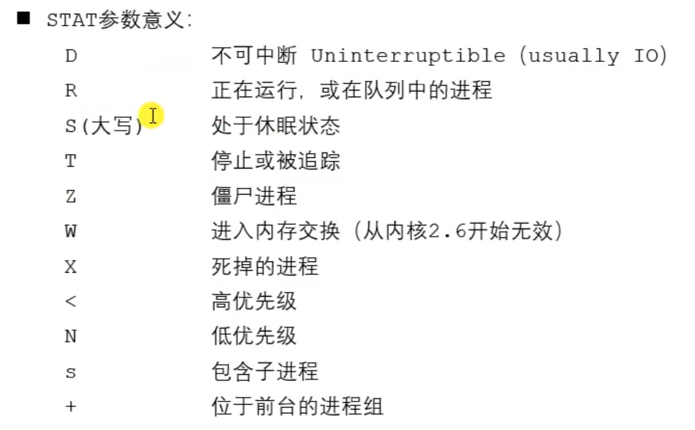

# 1. 进程创建fork()

## 1.1 进程基本操作

- 查看进程
```shell
ps aux / ajx
```



- 实时显示进程的动态
```shell
top
```

- 杀死进程

```shell
kill [-signal] pid
kill -l //列出所有信号
killall name //根据进程名杀死进程
```
例如以下命令可以强制杀死进程
```shell
kill -SIGKILL(或-9) 进程ID
```

## 1.2 进程号

每个进程都由进程号来标识，其类型为pid_t，进程号的范围是0~32767。

任何进程(除init进程)都是由另一个进程创建，该进程被称为被创建进程的父进程，对应的进程号称为父进程号(PPID)。

进程组是一个或多个进程的集合，它们之间相互关联，进程组可以接收同一终端的各种信号，关联的进程有一个进程组号(PGID)。默认情况下，当前的进程号会当作当前的进程组号。

相关函数：
```c
pid_t getpid(void);
pid_t getppid(void);
pid_t getpgid(pid_t pid);
```

## 1.3 进程创建fork()

系统允许一个进程创建新的子进程，从而形成进程树结构模型。

```c
#include <sys/types.h>
#include <unistd.h>

pid_t fork(void);
```
- 返回值：成功则在子进程中返回0，在父进程中返回子进程的进程ID；失败返回-1，失败主要有两个原因，一是当前系统的进程数已经达到了系统规定的上限，此时errno值被设置为EAGAIN，二是系统内存不足，此时errno值被设置为ENOMEM
- 作用：系统调用fork()用于创建子进程(一个完全相同的进程，复制父进程的地址空间，只有PCB中的一些数据如PID、PPID以及fork()的返回值不同)。子进程不会从main()函数开始执行，而是直接从fork()系统调用返回后继续执行。

事实上，更准确来说，fork()是通过==写时拷贝==(copy-on-write)来实现的。写时拷贝是一种可以推迟甚至避免拷贝数据的技术。调用fork()时内核并不复制整个进程的地址空间，而是让父子进程共享同一个地址空间，只有在需要写入的时候才会复制地址空间，从而使各个进程拥有各自的地址空间。即，资源的复制是在需要写入的时候才会进行，在此之前，以只读方式共享。注意，fork之后父子进程共享文件，父子进程相同的文件描述符指向相同的文件表，引用计数增加，共享文件偏移指针。

## 1.4 GDB多进程调试

使用GDB调试的时候，GDB默认只能跟踪一个进程，可以在fork函数调用之前，通过指令设置GDB调试工具跟踪父进程或者是跟踪子进程，默认跟踪父进程。

- 设置调试父进程或者子进程

```shell
set follow-fork-mode parent(默认，或者child)
```

- 设置调试模式

```shell
set detach-on-fork on(或者off)
```
默认为on，表示调试当前进程的时候，其他的进程继续运行。如果为off，则调试当前进程的时候，其他进程被GDB挂起。

- 查看调试的进程

```shell
info inferiors
```

- 切换当前调试的进程

```shell
inferior id
```

- 使进程脱离GDB调试

```shell
detach inferiors id
```

# 2. exec函数族

exec函数族的作用是根据指定的文件名找到可执行文件，并用它来取代调用进程的内容，换句话说，就是在调用进程内部执行一个可执行文件。exec函数族的函数执行成功后不会返回，因为调用进程的用户区(代码段、数据段、堆、栈等)已经被新内容取代，只留下进程ID等一些表面上的信息仍保持原样；只有调用失败后才会返回-1，并从原程序的调用点接着往下执行。

一般先创建一个子进程，然后在子进程中执行exec函数族中的函数。

```c
#include <unistd.h>
int execl(const char *pathname, const char *arg, ...
            /* (char  *) NULL */);
int execlp(const char *file, const char *arg, ...
            /* (char  *) NULL */);
int execle(const char *pathname, const char *arg, ...
            /*, (char *) NULL, char *const envp[] */);
int execv(const char *pathname, char *const argv[]);
int execvp(const char *file, char *const argv[]);
int execvpe(const char *file, char *const argv[],
            char *const envp[]);
int execve(const char *pathname, char *const argv[],
            char *const envp[]);
```
前6个函数是标准C库的函数，最后一个是UNIX系统调用。

|字母|含义|
|---|---|
|l(list)|参数地址列表，以空指针结尾|
|v(vector)|存有各参数地址的指针数组的地址|
|p(path)|按PATH环境变量指定的目录搜索可执行文件|
|e(environment)|存有环境变量字符串地址的指针数组的地址|

## 2.1 execl

```c
int execl(const char *pathname, const char *arg, ...
            /* (char  *) NULL */);
```
- 参数：pathname需要指定的可执行文件的路径；arg是执行可执行文件所需要的参数列表，第一个参数一般没什么作用，通常都写的是可执行程序的名称，第二个参数开始就是所需的参数列表，参数最后需要以NULL结束。
- 返回值：只有调用失败时才会返回，返回-1，并设置errno

## 2.2 execlp

```c
int execlp(const char *file, const char *arg, ...
            /* (char  *) NULL */);
```
- 参数：file是需要指定的可执行文件的文件名。execlp会到环境变量中查找指定的可执行文件，如果找了就执行，找不到则执行失败。


