# 1. 进程创建fork()

## 1.1 进程基本操作

- 查看进程
```shell
ps aux / ajx
```


- 实时显示进程的动态
```shell
top
```

- 杀死进程

```shell
kill [-signal] pid
kill -l //列出所有信号
killall name //根据进程名杀死进程
```
例如以下命令可以强制杀死进程
```shell
kill -SIGKILL(或-9) 进程ID
```

## 1.2 进程号

每个进程都由进程号来标识，其类型为pid_t，进程号的范围是0~32767。

任何进程(除init进程)都是由另一个进程创建，该进程被称为被创建进程的父进程，对应的进程号称为父进程号(PPID)。

进程组是一个或多个进程的集合，它们之间相互关联，进程组可以接收同一终端的各种信号，关联的进程有一个进程组号(PGID)。默认情况下，当前的进程号会当作当前的进程组号。

相关函数：
```c
pid_t getpid(void);
pid_t getppid(void);
pid_t getpgid(pid_t pid);
```

## 1.3 进程创建fork()

系统允许一个进程创建新的子进程，从而形成进程树结构模型。

```c
#include <sys/types.h>
#include <unistd.h>

pid_t fork(void);
```
- 返回值：==成功则在子进程中返回0，在父进程中返回子进程的进程ID==；失败返回-1，失败主要有两个原因，一是当前系统的进程数已经达到了系统规定的上限，此时errno值被设置为EAGAIN，二是系统内存不足，此时errno值被设置为ENOMEM
- 作用：系统调用fork()用于创建子进程(==一个完全相同的进程，复制父进程的地址空间，只有PCB中的一些数据如PID、PPID以及fork()的返回值不同==)。子进程不会从main()函数开始执行，而是直接从fork()系统调用返回后继续执行。

事实上，更准确来说，fork()是通过==写时拷贝==(copy-on-write)来实现的。写时拷贝是一种可以推迟甚至避免拷贝数据的技术。调用fork()时内核并不复制整个进程的地址空间，而是让父子进程共享同一个地址空间，只有在需要写入的时候才会复制地址空间，从而使各个进程拥有各自的地址空间。即，资源的复制是在需要写入的时候才会进行，在此之前，以只读方式共享。注意，fork之后父子进程共享文件，父子进程相同的文件描述符指向相同的文件表，引用计数增加，共享文件偏移指针。

## 1.4 GDB多进程调试

使用GDB调试的时候，GDB默认只能跟踪一个进程，可以在fork函数调用之前，通过指令设置GDB调试工具跟踪父进程或者是跟踪子进程，默认跟踪父进程。

- 设置调试父进程或者子进程

```shell
set follow-fork-mode parent(默认，或者child)
```

- 设置调试模式

```shell
set detach-on-fork on(或者off)
```
默认为on，表示调试当前进程的时候，其他的进程继续运行。如果为off，则调试当前进程的时候，其他进程被GDB挂起。

- 查看调试的进程

```shell
info inferiors
```

- 切换当前调试的进程

```shell
inferior id
```

- 使进程脱离GDB调试

```shell
detach inferiors id
```

# 2. exec函数族

exec函数族的作用是根据指定的文件名找到可执行文件，并用它来取代调用进程的内容，换句话说，就是在调用进程内部执行一个可执行文件。exec函数族的函数执行成功后不会返回，因为调用进程的用户区(代码段、数据段、堆、栈等)已经被新内容取代，只留下进程ID等一些表面上的信息仍保持原样；只有调用失败后才会返回-1，并从原程序的调用点接着往下执行。

==一般先创建一个子进程，然后在子进程中执行exec函数族中的函数。==

```c
#include <unistd.h>
int execl(const char *pathname, const char *arg, ...
            /* (char  *) NULL */);
int execlp(const char *file, const char *arg, ...
            /* (char  *) NULL */);
int execle(const char *pathname, const char *arg, ...
            /*, (char *) NULL, char *const envp[] */);
int execv(const char *pathname, char *const argv[]);
int execvp(const char *file, char *const argv[]);
int execvpe(const char *file, char *const argv[],
            char *const envp[]);
int execve(const char *pathname, char *const argv[],
            char *const envp[]);
```
前6个函数是标准C库的函数，最后一个是UNIX系统调用。

|字母|含义|
|---|---|
|l(list)|参数地址列表，以空指针结尾|
|v(vector)|存有各参数地址的指针数组的地址|
|p(path)|按PATH环境变量指定的目录搜索可执行文件|
|e(environment)|存有环境变量字符串地址的指针数组的地址|

## 2.1 execl()

```c
int execl(const char *pathname, const char *arg, ...
            /* (char  *) NULL */);
```
- 参数：pathname需要指定的可执行文件的路径；arg是执行可执行文件所需要的参数列表，第一个参数一般没什么作用，通常都写的是可执行程序的名称，第二个参数开始就是所需的参数列表，参数最后需要以NULL结束。
- 返回值：只有调用失败时才会返回，返回-1，并设置errno

## 2.2 execlp()

```c
int execlp(const char *file, const char *arg, ...
            /* (char  *) NULL */);
```
- 参数：file是需要指定的可执行文件的文件名。execlp会到环境变量中查找指定的可执行文件，如果找了就执行，找不到则执行失败。

# 3. 进程退出和回收

## 3.1 exit()

```c
#include <stdlib.h>
void exit(int status); //标准C库
#include <unistd.h>
void _exit(int status); //Linux系统调用
```

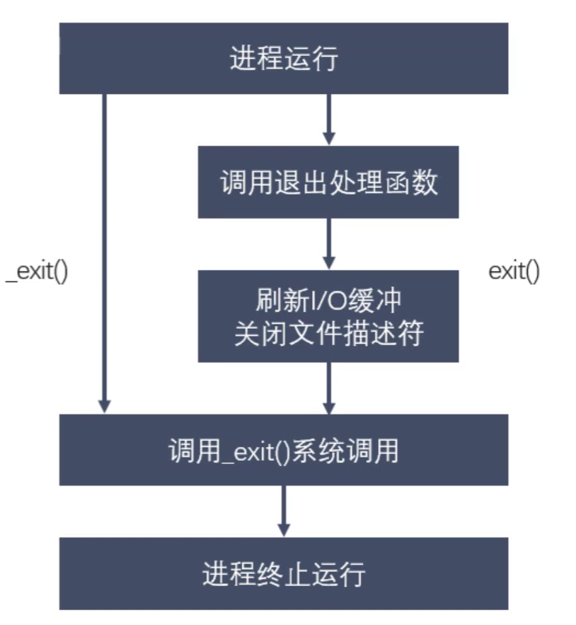

- 参数：status是进程退出时的一个状态信息，父进程回收子进程资源的时候可以获取到。

示例：
```c
    printf("hello\n");
    printf("world");
    exit(0);
```
将输出
```shell
hello
world
```
然而
```c
    printf("hello\n");
    printf("world");
    _exit(0);
```
将输出
```shell
hello
```
因为调用_exit不会刷新缓冲区，所以"world"仍在缓冲区内。

## 3.2 孤儿进程

父进程运行结束，但子进程还未运行结束，这样的子进程就称为孤儿(orphan)进程。==每当出现一个孤儿进程时，内核就把孤儿进程的父进程设置为init(进程ID为1)，而init进程会循环地wait()它的已经退出的子进程==。这样，当一个孤儿进程结束生命周期时，init进程就会处理善后工作，回收其资源。所以孤儿进程不会有什么危害。

## 3.3 僵尸进程

每个进程结束之后，都会释放自己地址空间中的用户区数据，内核区的PCB没有办法自己释放掉，需要父进程去释放。进程终止时，父进程尚未回收，子进程残留资源(PCB)存放于内核中，变成僵尸(zombie)进程。僵尸进程不能被kill -9杀死，这样就会导致一个问题：==如果父进程不调用wait()或waitpid()的话，那么保留的那段信息就不会释放，其进程号就会一直被占用，但是系统所能使用的进程号是有限的，如果产生大量僵尸进程，就会因为没有可用的进程号而导致系统不能产生新的进程，这就是僵尸进程的危害，应当避免==。

## 3.4 进程回收

在每个进程退出的时候，内核释放该进程所有的资源：包括打开的文件、占用的内存等，但是仍然为其保留一定的信息：主要是PCB的信息(进程号、退出状态、运行时间等)。父进程可以通过调用wait或waitpid得到子进程的退出状态同时彻底清除掉这个子进程。wait()和waitpid()功能一样，区别在于wait()函数会阻塞，而waitpid()可以设置不阻塞，并且waitpid()还可以指定等待哪个子进程结束。注意，一次wait或waitpid调用只能清理一个子进程，清理多个子进程应使用循环。

```c
#include <sys/types.h>
#include <sys/wait.h>

pid_t wait(int *wstatus);
```
- 作用：等待任意一个子进程结束，如果某一个子进程结束了，此函数会回收子进程的资源。
- 参数：wstatus是一个传出参数(int类型的地址)，指向进程退出时的状态信息。
- 返回值：成功则返回被回收的子进程的pid；失败则返回-1(失败有两种情况：一种是调用wait失败了，另一种是所有的子进程都结束了)

调用wait()函数的进程会被挂起(阻塞)，直到它的一个子进程退出或者收到一个不能忽略的信号时才会被唤醒。如果没有子进程，或是子进程都结束了，则调用wait()会立即返回-1

退出信息相关宏函数：
|宏|作用|
|---|---|
|WIFEXITED(status)|如果返回值非0，表示进程正常退出|
|WEXITSTATUS(status)|如果上面的宏为真，则获取进程退出的状态(即exit的参数)|
|WIFSIGNALED(status)|如果返回值非0，表示进程异常终止|
|WTERMSIG(status)|如果上面的宏为真，则获取使进程终止的信号编号|
|WIFSTOPPED(status)|如果返回值非0，表示进程处于暂停状态|
|WSTOPSIG(status)|如果上面的宏为真，则获取使进程暂停的信号编号|
|WIFCONTINUED(status)|如果返回值非0，表示进程暂停后已经继续运行|


```c
#include <sys/types.h>
#include <sys/wait.h>

pid_t waitpid(pid_t pid, int *wstatus, int options);
```
- 作用：回收指定进程号的子进程，可以设置是否阻塞。
- 参数：
  - pid：若pid > 0，则表示回收进程号为pid的子进程；若pid = 0，则表示回收当前进程组的任意子进程(注意当前进程的某些子进程可以在别的进程组)；若pid = -1，则表示回收任意子进程，相当于wait；若pid < -1，则表示回收组ID为-pid的进程组中的任意子进程。
  - wstatus与wait()的参数相同
  - options：用于设置阻塞或非阻塞，0表示阻塞，WNOHANG表示非阻塞
- 返回值：
  - 大于0：表示返回被回收的子进程的pid
  - 等于0：此时要求options = WNOHANG，表示还有子进程活着
  - 等于-1：表示调用失败或者所有子进程都结束了

可见wait(&st)等价于waitpid(-1, &st, 0)。


# 4. 进程间通信简介

进程是一个独立的资源分配单元，不同进程(通常指用户进程)之间的资源是独立的，所以不能在一个进程中直接访问另一个进程的资源。但是，不同的进程又需要进行信息的交互和状态的传递等，因此需要进程间通信(IPC: Inter Process Communication)。

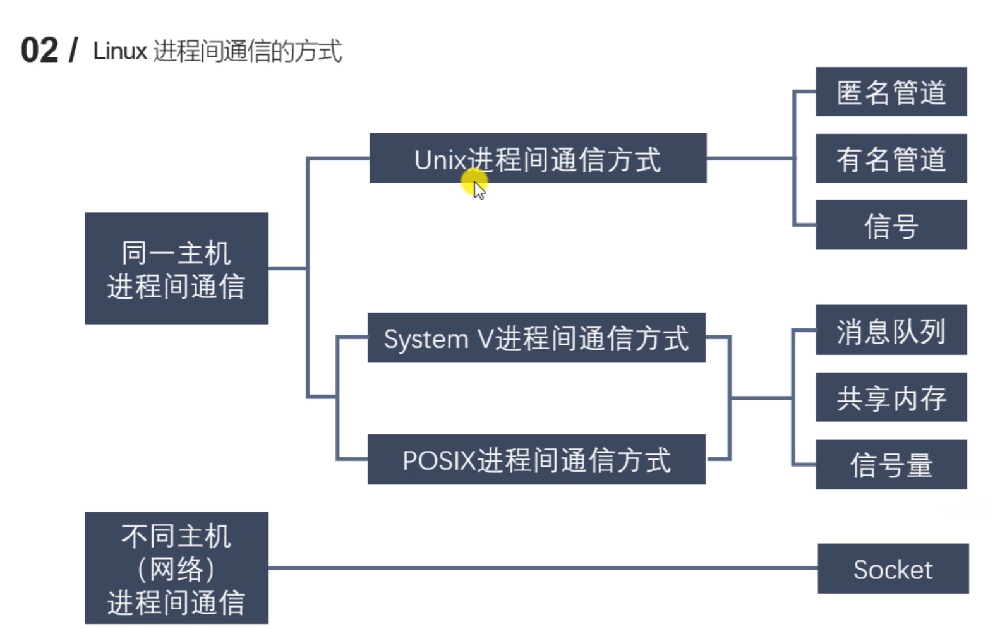

# 5. 管道

管道的特点：
- 管道其实是一个在内核内存中维护的**缓冲区**，这个缓冲区的存储能力是有限的，不同的操作系统大小不一定相同。
- 管道拥有**文件**的特质：读操作、写操作，==匿名管道没有文件实体，有名管道有文件实体、但不存储数据==。可以按照操作文件的方式对管道进行操作，管道的读端只能用来从管道中读取，写端只能用来将数据写入管道，读/写端通过不同文件描述符表示。所以==管道可表示为两个文件描述符加一段内核空间中的内存==。
- 一个管道是一个**字节流**，使用管道时不存在消息或者消息边界的概念，从管道读取数据的进程可以读取任意大小的数据块，而不管写入进程写入管道的数据块的大小是多少。
- 通过管道传递的数据是**顺序**的，从管道中读取出来的字节的顺序和它们被写入管道的顺序是完全一样的。
- 在管道中的数据的传递方向是**单向**的，写端只能用于写入，读端只能用于读取，管道是==半双工==的，某一时间段内只能实现单向的传输。
- 从管道读数据是**一次性**操作，数据一旦被读走，它就从管道中被抛弃，释放空间以便写更多的数据，所以在管道中无法使用lseek()来随机地访问数据。
- ==匿名管道只能在具有公共祖先的进程==(父进程与子进程，或者两个兄弟进程，或者具有亲缘关系的进程)之间使用，这是因为只有fork()出来的进程，它们相同的文件描述符才会指向相同的匿名管道，所以==必须在父进程调用fork()之前创建匿名管道==。

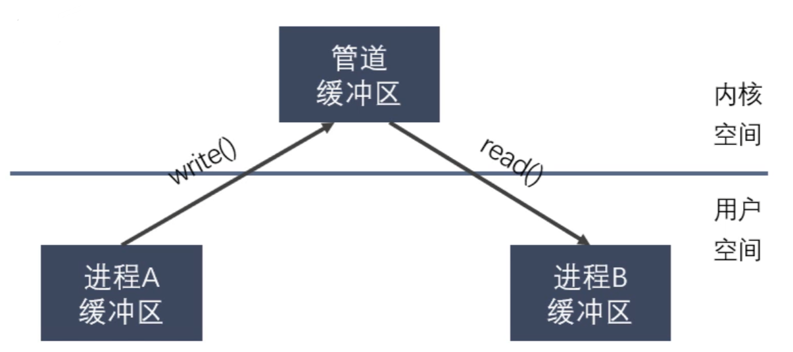

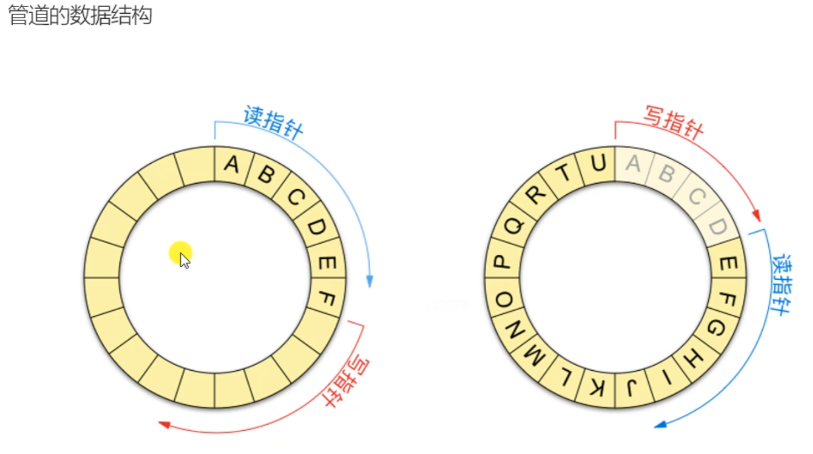

## 5.1 匿名管道

一般将匿名管道简称为管道，它是UNIX系统IPC最古老的形式，所有的UNIX系统都支持这种通信机制。

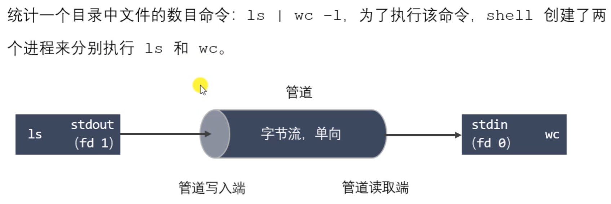

```c
#include <unistd.h>

int pipe(int pipefd[2]);
```
- 作用：创建一个匿名管道，用于进程间通信。
- 参数：int pipefd[2]这个数组是一个传出参数，==pipefd[0]对应管道的读端，pipefd[1]对应管道的写端==。
- 返回值：成功返回0，失败返回-1


```shell
ulimit -a
```
- 作用：查看管道缓冲大小

```c
#include <unistd.h>

long fpathconf(int fd, int name);
```
- 作用：查看管道缓冲大小，用法如下

```c
long size = fpathconf(pipefd[0], _PC_PIPE_BUF);
```

一般来说，对于一个匿名管道，父进程只使用其一端(例如读端)，则在父进程中最好关闭写端，同样，子进程中最好关闭读端，以防止发生子进程写完后又自己再从管道中读回来的情况。

==默认为阻塞的管道(匿名管道/有名管道)的读写特点==：
- 如果管道写端的引用计数为0，那么管道中剩余的数据被读取完后，进程再次调用read()会返回0，就像读到文件末尾一样。
- 如果管道写端的引用计数大于0，那么管道中剩余的数据被读取完后，进程再次调用read()会阻塞，直到管道中有数据可以读了才读取数据并返回。
- 如果管道读端的引用计数为0，那么进程调用write()写数据时会收到一个信号SIGPIPE，通常会导致进程异常终止。
- 如果管道读端的引用计数大于0，那么当管道被写满时，进程再调用write()会阻塞，直到管道中有空位置才能再次写入数据然后返回。

可以使用fcntl()来设置管道非阻塞：
```c
//设置管道非阻塞
int flags = fcntl(fd[0], F_GETFL); //获取原来的flag
flags |= O_NONBLOCK; //修改flag的值，设置非阻塞
fcntl(fd[0], F_SETFL, flags); //设置新的flag
```

## 5.2 有名管道

匿名管道由于没有名字，只能用于具有亲缘关系的进程间通信。为了克服这个缺点，提出了有名管道(FIFO)，也称为命名管道、FIFO文件。

FIFO不同于匿名管道，它提供了一个路径名与之关联，以FIFO的文件形式存在于文件系统中，并且其打开方式与打开一个普通文件是一样的。所以即使是不相关的进程，只要可以访问该路径，就能够彼此通过FIFO相互通信。

一旦打开了FIFO，就能在它上面使用与操作匿名管道和其他文件的系统调用一样的I/O系统调用(如read()、write()、close())。与管道一样，FIFO也有一个写入端和读取端，并且从管道中读取数据的顺序与写入的顺序是一样的，所以FIFO的名称也由此而来(先进先出)。

有名管道(FIFO)和匿名管道(pipe)有一些特点是相同的，不同之处在于：
- FIFO在文件系统中作为一个特殊文件存在，而FIFO中的内容却存放在内存中。
- 当使用FIFO的进程退出后，FIFO文件将继续保存在文件系统中以便以后使用。
- FIFO有名字，不相关的进程可以通过打开有名管道进行通信。

通过命令创建有名管道：
```shell
mkfifo 名字
```

通过标准C库函数创建有名管道：
```c
#include <sys/types.h>
#include <sys/stat.h>

int mkfifo(const char *pathname, mode_t mode);
```
- 参数：pathname是管道名称的路径；mode是文件的权限，与open()的mode是一样的
- 返回值：成功返回0，失败返回-1

注意：一个只读打开有名管道的进程会阻塞，直到另一个进程打开该管道的写端；同样地，一个只写打开有名管道的进程也会阻塞，直到另一个进程打开该管道的读端。

# 6. 内存映射

内存映射(Memory-mapped I/O)是将磁盘文件的数据映射到内存，用户通过修改内存就能修改磁盘文件。


```c
#include <sys/mman.h>

void *mmap(void *addr, size_t length, int prot, int flags, 
            int fd, off_t offset);
```
- 作用：将一个文件的数据映射到内存中
- 参数：
  - addr是映射到内存的起始地址，一般使用NULL，意味着由内核指定起始地址
  - length是要映射的数据长度，这个值不能为0，一般使用文件的长度(可以使用stat或lseek获取)
  - prot是对申请的内存映射区的操作权限(要操作映射内存，必须要有读权限，一般就使用PROT_READ | PROT_WRITE)
    - PROT_EXEC：可执行的权限
    - PROT_READ：读权限
    - PROT_WRITE：写权限
    - PROT_NONE：没有权限
  - flags：
    - MAP_SHARED：映射区的数据会自动和磁盘文件进行同步，要进行进程间通信必须要设置这个选项
    - MAP_PRIVATE：不同步，即修改映射区的数据并不会修改磁盘上原来的文件，而是会重新创建一个新的文件(copy-on-write)
    - MAP_ANONYMOUS：创建匿名映射，即不需要文件实体，所以后面的参数fd应为-1，offset应为0
  - fd是要映射的文件的文件描述符，通过open得到，注意文件的大小不能为0，且open指定的权限不能与上述prot参数有冲突
  - offset：文件偏移量，一般不使用(因为必须指定为4K的整数倍，否则会调用mmap失败)，所以一般就传入0
- 返回值：返回创建的内存的首地址；失败则返回MAP_FAILED，即(void *) -1


```c
#include <sys/mman.h>

int munmap(void *addr, size_t length);
```
- 作用：释放内存映射
- 参数：addr是要释放的内存的首地址；length是要释放的内存的大小，要和mmap函数中的length参数的值相同

以下是使用内存映射进行进程间通信的示例(事实上，没有关系的进程也可以通过内存映射来通信)：
```c
#include <stdio.h>
#include <sys/mman.h>
#include <sys/types.h>
#include <sys/stat.h>
#include <fcntl.h>
#include <unistd.h>
#include <string.h>
#include <sys/wait.h>
#include <stdlib.h>

int main() {
    int fd = open("file.txt", O_RDWR);
    int size = lseek(fd, 0, SEEK_END);

    void* ptr = mmap(NULL, size, PROT_READ | PROT_WRITE, MAP_SHARED, fd, 0);
    if (ptr == MAP_FAILED) {
        perror("mmap");
        exit(0);
    }

    pid_t pid = fork();
    if (pid > 0) {
        wait(NULL);
        char buf[64];
        strcpy(buf, (char*) ptr);
        printf("read data : %s\n", buf);
    } else if (pid == 0) {
        strcpy((char*) ptr, "hello, parent!!");
    }
    munmap(ptr, size);
    return 0;
}
```

也可以使用匿名映射，即不需要文件实体就可以进行内存映射，只能用于具有亲缘关系的进程之间。示例：
```c
void* ptr = mmap(NULL, size, PROT_READ | PROT_WRITE, 
    MAP_SHARED | MAP_ANONYMOUS, -1, 0);
```

使用内存映射的一些注意事项：
- 对mmap()的返回值ptr可以进行++操作，但是不建议这样做，因为调用munmap()将无法正确释放内存映射
- 如果open时权限为O_RDONLY，而mmap时参数prot指定为PROT_READ | PROT_WRITE，则会发生错误，返回MAP_FAILED，因为prot参数的权限要小于等于open的权限。
- mmap()调用失败的一些可能情况：
  - length = 0
  - prot没有PROT_READ权限
  - prot与fd的权限产生冲突
  - offset不是4K的整数倍
- mmap()后关闭文件描述符fd，对内存映射不会有影响，因为映射区仍然存在，只是关闭了fd而已
- 对mmap()的返回值ptr进行越界操作，会发生段错误
- 内存映射最主要的作用是进行进程间通信，除此之外还有一些其他作用，例如实现文件拷贝等。

# 7. 信号

## 7.1 信号概述

信号是Linux进程间通信的最古老的方式之一，是事件发生时对进程的通知机制，有时也称之为软件中断，它是在软件层次上对中断机制的一种模拟，是一种异步通信的方式。信号可以导致一个正在运行的进程被另一个正在运行的异步进程中断，转而处理某一突发事件。

发往进程的诸多信号，通常都是源于内核。引发内核为进程产生信号的各类事件如下：
- 对于前台进程，用户可以通过输入特殊的终端字符来给它发送信号。比如输入Ctrl+C通常会给进程发送一个中断信号。
- 硬件发生异常，即硬件检测到一个错误条件并通知内核，随即再由内核发送相应信号给相关进程。比如执行一条异常的机器语言指令，例如被0除、或是引用了无法访问的内存区域。
- 系统状态变化，比如alarm定时器到期将引起SIGALRM信号，进程执行的CPU时间超限，或者该进程的某个子进程退出。
- 运行kill命令或调用kill函数。

使用信号的两个主要目的：
- 让进程知道已经发生了一个特定的事情
- 强迫进程执行它自己代码中的信号处理程序

信号的特点：
- 简单
- 不能携带大量信息
- 满足某个特定条件才发送
- 优先级比较高

我们可以用kill -l命令查看系统定义的信号列表，用命令man 7 signal查看信号的详细信息，前31个信号为常规信号，其余为实时信号。

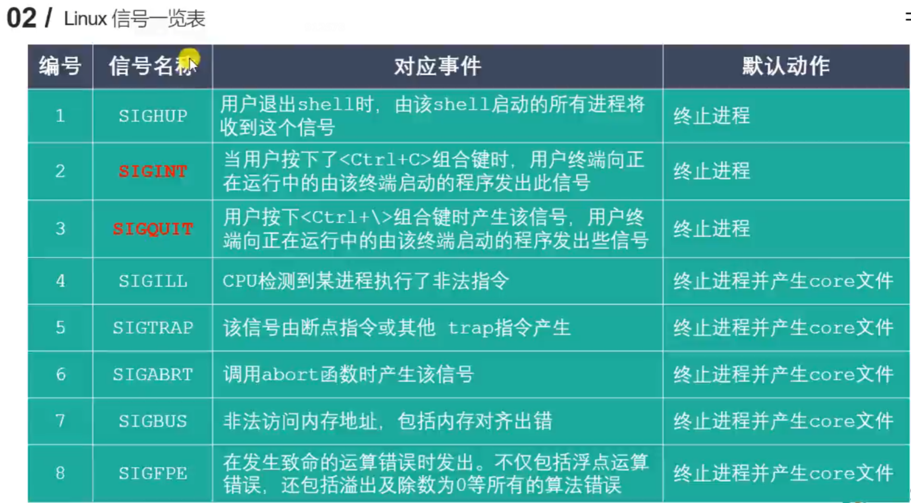

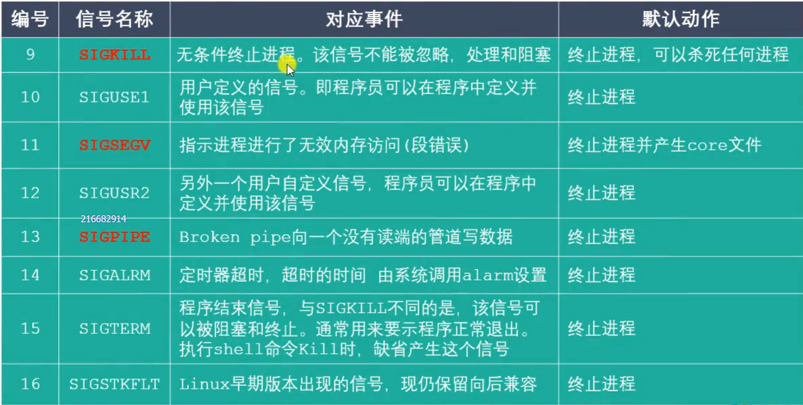

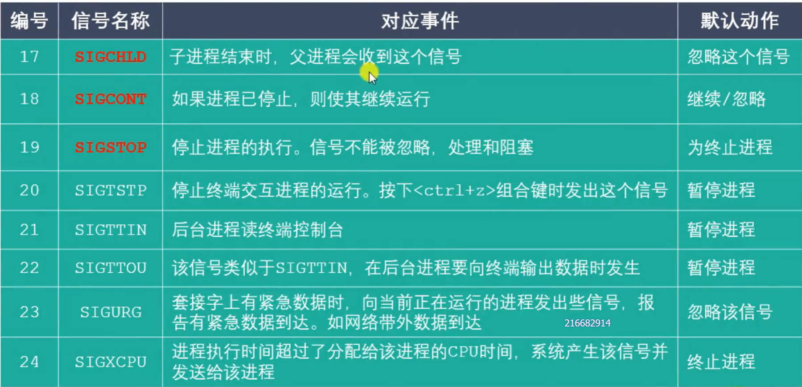

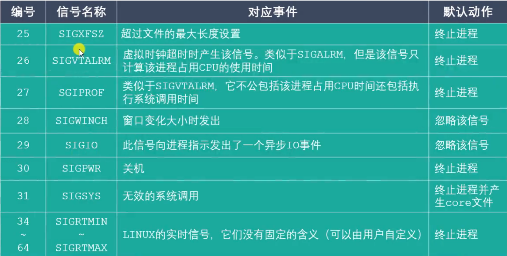

信号的5种默认处理动作：
- Term：终止进程
- Ign：当前进程忽略掉这个信号
- Core：终止进程，并生成一个Core文件
- Stop：暂停当前进程
- Cont：继续执行当前被暂停的进程

信号的几种状态：产生、未决、递达

注意：SIGKILL和SIGSTOP信号不能被捕捉、阻塞或者忽略，只能执行默认动作。

## 7.2 kill、raise、abort

```c
#include <sys/types.h>
#include <signal.h>

int kill(pid_t pid, int sig);
```
- 作用：==给某个进程或进程组发送某个信号==
- 参数：
  - pid：
    - 大于0 ：将信号发送给进程号为pid的进程
    - 等于0 ：将信号发送给当前进程组
    - 等于-1：将信号发送给每一个有权限接收这个信号的进程
    - 小于-1：将信号发送给进程号为-pid的进程组
  - ==sig是要发送的信号(编号，或者宏值)，如果为0则表示不发送信号==
- 返回值：成功返回0，失败返回-1

```c
#include <signal.h>

int raise(int sig);
```
- 作用：给当前进程发送信号
- 参数：sig是要发送的信号
- 返回值：成功返回0，失败返回-1

```c
#include <stdlib.h>

void abort(void);
```
- 作用：发送SIGABRT信号给当前进程，杀死当前进程

## 7.3 alarm

```c
#include <unistd.h>

unsigned int alarm(unsigned int seconds);
```
- 作用：设置定时器，函数调用后开始倒计时，当倒计时为0时会给当前进程发送一个SIGALRM信号(默认终止当前进程)
- 参数：seconds是倒计时的时长(单位：秒)，==如果为0则定时器无效(即不进行倒计时，也不发送信号)==，所以我们可以通过调用alarm(0)来取消定时器(注意每个进程都有且只有一个定时器)。
- 返回值：如果之前没有调用过alarm，则返回0；如果之前调用过alarm，则返回之前的alarm倒计时剩余的时间。例如首先调用alarm(10)，返回0，过了一秒后调用alarm(5)，返回9，==并且之前alarm的设定都会取消==。

注意alarm是不阻塞的，调用alarm后进程会继续执行下面的代码。定时器与进程的状态无关，即无论进程处于什么状态，定时器都会计时(自然定时法)。

## 7.4 setitimer

```c
#include <sys/time.h>

int setitimer(int which, const struct itimerval *new_value,
              struct itimerval *old_value);
```
- 作用：设置定时器，可以实现周期性定时，精度微秒
- 参数：
  - which：定时器以什么时间计时
    - ITIMER_REAL：真实时间(包括用户态下消耗的时间、内核态下消耗的时间、用户态内核态切换消耗的时间)，时间到达则发送SIGALRM信号
    - ITIMER_VIRTUAL：用户态下消耗的时间，时间到达则发送SIGVTALRM信号
    - ITIMER_PROF：用户态和内核态下消耗的总时间，时间到达则发送SIGPROF信号
  - new_value：设置定时器的属性
  - old_value：记录上一次的定时器的时间参数，一般不使用，传入NULL即可
- 返回值：成功返回0，失败返回-1


```c
struct itimerval { //定时器结构体
    struct timeval it_interval; //定时器间隔时间
    struct timeval it_value; //延迟多长时间执行定时器
};

struct timeval { //时间结构体
    time_t      tv_sec;  //秒
    suseconds_t tv_usec; //微秒
};
```

## 7.5 信号捕捉函数signal()

```c
#include <signal.h>
typedef void (*sighandler_t)(int); //int参数表示捕捉到的信号编号

sighandler_t signal(int signum, sighandler_t handler);
```
- 作用：设置某个信号的捕捉行为
- 参数：signum是要捕捉的信号，handler是信号处理方式，有以下几种值：
  - SIG_IGN：忽略信号
  - SIG_DFL：使用信号默认的行为
  - 回调函数：这是由程序员写的信号处理函数，但却是由内核去调用的
- 返回值：成功则返回上一次调用的信号处理函数的地址，第一次调用则返回NULL；失败则返回SIG_ERR，并设置errno

注意：SIGKILL和SIGSTOP信号不能被捕捉、阻塞或者忽略，只能执行默认动作。

## 7.6 信号集

许多信号相关的系统调用都需要能表示一组不同的信号，多个信号可使用一个称之为信号集的数据结构来表示，其系统数据类型为sigset_t(==其实就是一个64位整数==)。

在PCB中有两个非常重要的信号集，一个是阻塞信号集，另一个是未决信号集。它们都是内核使用==位图==机制来实现的，但操作系统不允许我们直接对这两个信号集进行位操作，所以我们需要自定义另外一个集合，然后借助信号集操作函数来对PCB中的这两个信号集进行修改。

信号的未决是一种状态，指的是从信号的产生到信号被处理前的这一段时间。信号的阻塞是一个开关动作，指的是阻止信号被处理，但不是阻止信号的产生，即让系统暂时保留信号留待以后发送，一般来说信号的阻塞只是暂时的，只是为了防止信号打断敏感的操作。

例如用户通过键盘输入Ctrl + C产生了2号信号SIGINT，在该信号被处理之前，内核维护的未决信号集中将2号标志位置1，表示2号信号是未决状态。在处理该信号之前，需要与阻塞信号集对比，如果阻塞信号集的2号位也为1，则表示该信号被阻塞，于是该信号会一直处于未决状态直到阻塞解除。(阻塞信号集默认为全0，即不阻塞任何信号，如果想要阻塞某些信号，需要用户调用系统API)。如果阻塞期间又产生了多个SIGINT信号，则这些信号会被丢弃(实时信号除外)，因为未决信号集标志位只能记录1或0，不能记录该信号的数量。

```c
#include <signal.h>

int sigemptyset(sigset_t *set);
int sigfillset(sigset_t *set);
int sigaddset(sigset_t *set, int signum);
int sigdelset(sigset_t *set, int signum);
int sigismember(const sigset_t *set, int signum);
```
- 作用：
  - sigemptyset将信号集set中的所有标志位置0
  - sigfillset将信号集set中的所有标志位置1
  - sigaddset将信号集set中信号signum对应的标志位置1，表示阻塞该信号
  - sigdelset将信号集set中信号signum对应的标志位置0，表示不阻塞该信号
  - sigismember判断信号signum在信号集set中是否被阻塞，即对应的标志位是否为1
- 参数：
  - set是需要操作的信号集
  - signum是需要操作的信号编号
- 返回值：前4个函数成功返回0，失败返回-1；sigismember与此不同，它返回1表示标志位是1，返回0表示标志位是0，返回-1表示调用失败。

```c
#include <signal.h>

int sigprocmask(int how, const sigset_t *set, sigset_t *oldset);
```
- 作用：将自定义信号集中的数据设置到内核的阻塞信号集中
- 参数：
  - how：如何对内核阻塞信号集进行处理
    - SIG_BLOCK：将set中阻塞的信号添加到内核阻塞信号集mask中，即相当于 mask |= set
    - SIG_UNBLOCK：将set中标志位为1的信号解除，即相当于 mask &= ~set
    - SIG_SETMASK：用set覆盖内核阻塞信号集mask
  - set：用户自定义的信号集
  - oldset：保存设置之前的内核阻塞信号集，一般不使用，传入NULL即可
- 返回值：成功返回0；失败返回-1，并设置errno(EFAULT或EINVAL)

```c
#include <signal.h>

int sigpending(sigset_t *set);
```
- 作用：获取内核中的未决信号集
- 参数：set是传出参数，用于保存内核中的未决信号集
- 返回值：成功返回0，失败返回-1

## 7.7 信号捕捉函数sigaction()

```c
#include <signal.h>

int sigaction(int signum, const struct sigaction *act,
              struct sigaction *oldact);
```
- 作用：检查或改变信号的处理方式
- 参数：signum是要捕捉的信号编号；act是捕捉到信号之后的处理动作；oldact是上一次对信号捕捉的相关设置，一般不使用，传递NULL即可
- 返回值：成功返回0，失败返回-1

```c
struct sigaction {
    //函数指针，指向的是信号处理函数
    void     (*sa_handler)(int);
    //不常用
    void     (*sa_sigaction)(int, siginfo_t *, void *);
    //临时阻塞信号集，在信号捕捉函数执行过程中临时阻塞某些信号，执行完毕后不再阻塞
    sigset_t   sa_mask;
    //0表示使用sa_handler函数处理信号，SA_SIGINFO表示使用sa_sigaction处理信号
    int        sa_flags;
    //已被废弃
    void     (*sa_restorer)(void);
};
```

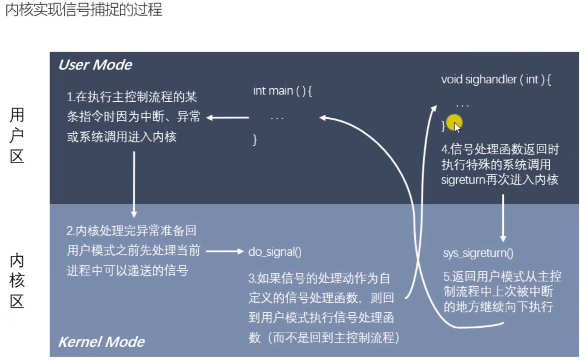

## 7.8 信号SIGCHLD

SIGCHLD信号产生的时机：
- 子进程终止时
- 子进程接收到SIGSTOP信号停止时
- 子进程处在停止态，接收到SIGCONT后唤醒时

以上三种情况都会给父进程发送SIGCHLD信号，父进程默认会忽略该信号。可以设置对信号SIGCHLD的处理方式来处理僵尸进程。

# 8. 共享内存

共享内存允许两个或者多个进程共享物理内存的同一块区域(通常称为段)。由于一个共享内存段会成为一个进程用户空间的一部分，因此这种IPC机制几乎无需内核介入。所有需要做的就是让一个进程将数据复制进共享内存中，并且这部分数据会对其他所有共享同一个段的进程可用。

与管道等要求发送进程将数据从用户空间的缓冲区复制进内核内存和接收进程将数据从内核内存复制进用户空间的缓冲区的做法相比，共享内存这种IPC技术的速度更快。

共享内存的使用步骤：
- 调用shmget()创建一个新共享内存段或取得一个既有共享内存段的标识符(即由其他进程创建的共享内存段)。这个调用将返回后续调用中需要用到的共享内存标识符。
- 使用shmat()来附上共享内存段，即使该段成为调用进程的虚拟内存的一部分。
- 此刻在程序中可以像对待其他可用内存那样对待这个共享内存段。为引用这块共享内存，程序需要使用由shmat()调用返回的addr值，它是一个指向进程的虚拟地址空间中该共享内存段的起点的指针。
- 调用shmdt()来分离共享内存段。在这个调用之后，进程就无法再引用这块共享内存了。这一步是可选的，并且在进程终止时会自动完成这一步。
- 调用shmctl()来删除共享内存段。只有当当前所有附加内存段的进程都与之分离之后内存段才会销毁。只有一个进程需要执行这一步。

```c
#include <sys/ipc.h>
#include <sys/shm.h>

int shmget(key_t key, size_t size, int shmflg);
```
- 作用：创建一个新共享内存段或取得一个既有共享内存段的标识符。注意新创建的内存段中的数据都会被初始化为0
- 参数：
  - key：key_t是整型，key是非零值，一般用16进制表示，通过key找到或者创建一个共享内存。
  - size：共享内存的大小
  - shmflg：共享内存的属性，包括访问权限和附加属性：IPC_CREAT用于创建共享内存(必须要有，即使是获取一个共享内存)，IPC_EXCL用于判断共享内存是否存在(必须与IPC_CREAT一起使用)
- 返回值：成功则返回共享内存的标识符，失败返回-1

```c
#include <sys/types.h>
#include <sys/shm.h>

void *shmat(int shmid, const void *shmaddr, int shmflg);
```
- 作用：和当前的进程进行关联
- 参数：
  - shmid：共享内存的标识符
  - shmaddr：申请的共享内存的起始地址，一般传入NULL，由内核指定
  - shmflg：SHM_RDONLY表示有读权限(对共享内存必须要有读权限)，一般传入0表示有读写权限
- 返回值：成功则返回共享内存的起始地址，失败则返回(void *) -1

```c
#include <sys/types.h>
#include <sys/shm.h>

int shmdt(const void *shmaddr);
```
- 作用：解除当前进程和共享内存的关联
- 参数：shmaddr是共享内存的首地址
- 返回值：成功返回0，失败返回-1

```c
#include <sys/ipc.h>
#include <sys/shm.h>

int shmctl(int shmid, int cmd, struct shmid_ds *buf);
```
- 作用：操作共享内存
- 参数：
  - shmid：共享内存的标识符
  - cmd：要做的操作
    - IPC_STAT：获取共享内存当前的状态
    - IPC_SET：设置共享内存的状态
    - IPC_RMID：标记共享内存被销毁
  - buf：需要设置或者获取的共享内存的属性信息

```c
#include <sys/types.h>
#include <sys/ipc.h>

key_t ftok(const char *pathname, int proj_id);
```
- 作用：根据指定的路径名和int值生成一个共享内存的key
- 参数：pathname是一个路径；proj_id是一个int值，但只会用到其中的一个字节，所以一般传入一个字符即可(1~255)

共享内存操作的shell命令：
```shell
ipcs -a    //打印当前系统中所有的进程间通信方式的信息
ipcs -m    //打印出使用共享内存进行进程间通信的信息
ipcs -q    //打印出使用消息队列进行进程间通信的信息
ipcs -s    //打印出使用信号进程进程间通信的信息
ipcrm -M shmkey   //移除用shmkey创建的共享内存段
ipcrm -m shmid    //移除用shmid标识的共享内存段
ipcrm -Q msqkey   //移除用msqkey创建的消息队列
ipcrm -q msqid    //移除用msqid标识的消息队列
ipcrm -S semkey   //移除用semkey创建的信号
ipcrm -s semid    //移除用semid标识的信号
```

注：
- 共享内存维护了一个结构体struct shmid_ds，其中有一个成员shm_nattch用于记录关联进程的个数。
- 可以多次调用shmctl对共享内存进行删除，因为shmctl只是标记删除共享内存(此时共享内存的key为0)，而并不是直接删除，只有当共享内存关联的进程数为0时才是真正删除。
- 共享内存和内存映射的区别：
  1. 共享内存可以直接创建，但内存映射需要磁盘文件(匿名映射除外)
  2. 共享内存速度更快
  3. 对于共享内存，所有的进程操作的是同一块共享内存；而对于内存映射，每个进程在自己的虚拟地址空间中有一块独立的内存。
  4. 如果进程突然退出了，则共享内存还存在(只是该进程与共享内存取消关联了)，但内存映射区消失了；如果电脑突然关机了，则共享内存中的数据没有了，但由于磁盘文件中的数据还存在，所以内存映射区中的数据并不会消失。


# 9. 守护进程

## 9.1 终端

在UNIX系统中，用户通过终端登录系统后得到一个shell进程，这个终端成为shell进程的控制终端(Controlling Terminal)，进程中，控制终端是保存在PCB中的信息，而fork()会复制PCB中的信息，因此由shell进程启动的其他进程的控制终端也是这个终端。

默认情况下(没有重定向)，每个进程的标准输入、标准输出和标准错误输出都指向控制终端，进程从标准输入读也就是读用户的键盘输入，进程往标准输出或标准错误输出写也就是输出到显示器上。

在控制终端输入一些特殊的控制键可以给前台进程发信号，例如Ctrl+C会产生SIGINT信号，Ctrl+\会产生SIGQUIT信号。

## 9.2 进程组

进程组和会话在进程之间形成了一种两级层次关系：进程组是一组相关进程的集合，会话是一组相关进程组的集合。进程组和会话是为支持shell作业控制而定义的抽象概念，用户通过shell能够交互式地在前台或后台运行命令。

进程组由一个或多个共享同一进程组标识符(PGID)的进程组成。一个进程组拥有一个进程组首进程，该进程是创建该组的进程，其进程ID为该进程组的ID，新进程会继承其父进程所属的进程组ID。

进程组拥有一个生命周期，其开始时间为首进程创建组的时刻，结束时间为最后一个成员进程退出组的时刻。一个进程可能会因为终止而退出进程组，也可能会因为加入了另外一个进程组而退出进程组。进程组首进程无需是最后一个离开进程组的成员。

## 9.3 会话

会话是一组进程组的集合。会话首进程是创建该会话的进程，其进程ID会成为会话ID。新进程会继承其父进程的会话ID。

一个会话中的所有进程共享单个控制终端。控制终端会在会话首进程首次打开一个终端设备时被建立。一个终端最多可能会成为一个会话的控制终端。

在任一时刻，会话中的其中一个进程组会成为终端的前台进程组，其他进程组会成为后台进程组。只有前台进程组中的进程才能从控制终端中读取输入。当用户在控制终端中输入终端字符生成信号后，该信号会被发送到前台进程组中的所有成员。

当控制终端的连接建立起来之后，会话首进程会成为该终端的控制进程。

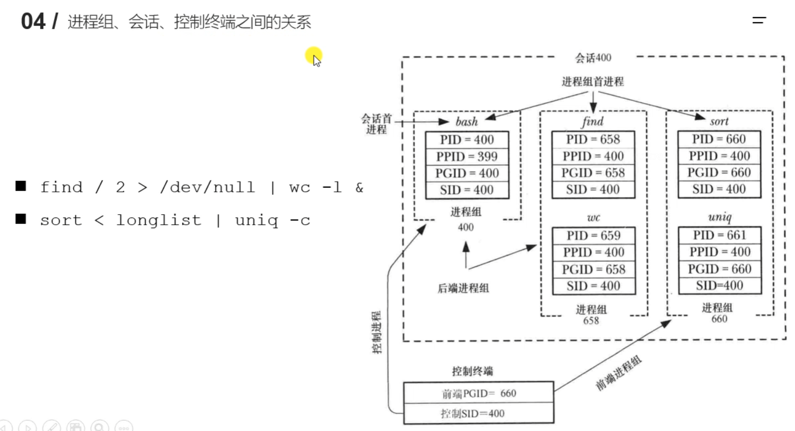

进程组、会话操作函数：
```c
pid_t getpgrp(void);
pid_t getpgid(pid_t pid);
int setpgid(pid_t pid, pid_t pgid);
pid_t getsid(pid_t pid);
```

## 9.4 守护进程

守护进程(Daemon Process)也就是通常说的Daemon进程(精灵进程)，是Linux中的后台服务进程。它是一个生存期较长的进程，通常独立于控制终端并且周期性地执行某种任务或等待处理某些发生的事件。一般采用以d结尾的名字。

守护进程具有下列特征：
- 生命周期很长，守护进程会在系统启动的时候被创建并一直运行直至系统被关闭。
- 它在后台运行并且不拥有控制终端。没有控制终端确保了内核永远不会为守护进程自动生成任何控制信号以及终端相关的信号(如SIGINT、SIGQUIT)。

Linux的大多数服务器就是用守护进程实现的。比如Internet服务器inetd，Web服务器httpd等。


