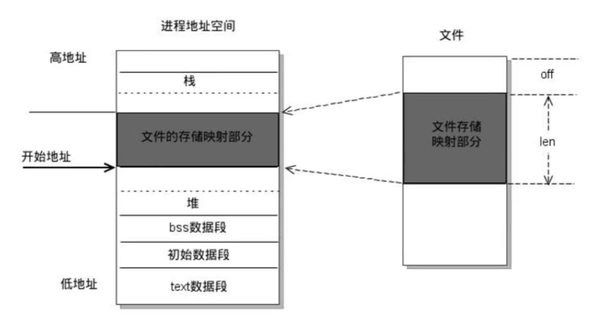

# 1. 进程创建fork()

## 1.1 进程基本操作

- 查看进程
```shell
ps aux / ajx
```


- 实时显示进程的动态
```shell
top
```

- 杀死进程

```shell
kill [-signal] pid
kill -l //列出所有信号
killall name //根据进程名杀死进程
```
例如以下命令可以强制杀死进程
```shell
kill -SIGKILL(或-9) 进程ID
```

## 1.2 进程号

每个进程都由进程号来标识，其类型为pid_t，进程号的范围是0~32767。

任何进程(除init进程)都是由另一个进程创建，该进程被称为被创建进程的父进程，对应的进程号称为父进程号(PPID)。

进程组是一个或多个进程的集合，它们之间相互关联，进程组可以接收同一终端的各种信号，关联的进程有一个进程组号(PGID)。默认情况下，当前的进程号会当作当前的进程组号。

相关函数：
```c
pid_t getpid(void);
pid_t getppid(void);
pid_t getpgid(pid_t pid);
```

## 1.3 进程创建fork()

系统允许一个进程创建新的子进程，从而形成进程树结构模型。

```c
#include <sys/types.h>
#include <unistd.h>

pid_t fork(void);
```
- 返回值：==成功则在子进程中返回0，在父进程中返回子进程的进程ID==；失败返回-1，失败主要有两个原因，一是当前系统的进程数已经达到了系统规定的上限，此时errno值被设置为EAGAIN，二是系统内存不足，此时errno值被设置为ENOMEM
- 作用：系统调用fork()用于创建子进程(==一个完全相同的进程，复制父进程的地址空间，只有PCB中的一些数据如PID、PPID以及fork()的返回值不同==)。子进程不会从main()函数开始执行，而是直接从fork()系统调用返回后继续执行。

事实上，更准确来说，fork()是通过==写时拷贝==(copy-on-write)来实现的。写时拷贝是一种可以推迟甚至避免拷贝数据的技术。调用fork()时内核并不复制整个进程的地址空间，而是让父子进程共享同一个地址空间，只有在需要写入的时候才会复制地址空间，从而使各个进程拥有各自的地址空间。即，资源的复制是在需要写入的时候才会进行，在此之前，以只读方式共享。注意，fork之后父子进程共享文件，父子进程相同的文件描述符指向相同的文件表，引用计数增加，共享文件偏移指针。

## 1.4 GDB多进程调试

使用GDB调试的时候，GDB默认只能跟踪一个进程，可以在fork函数调用之前，通过指令设置GDB调试工具跟踪父进程或者是跟踪子进程，默认跟踪父进程。

- 设置调试父进程或者子进程

```shell
set follow-fork-mode parent(默认，或者child)
```

- 设置调试模式

```shell
set detach-on-fork on(或者off)
```
默认为on，表示调试当前进程的时候，其他的进程继续运行。如果为off，则调试当前进程的时候，其他进程被GDB挂起。

- 查看调试的进程

```shell
info inferiors
```

- 切换当前调试的进程

```shell
inferior id
```

- 使进程脱离GDB调试

```shell
detach inferiors id
```

# 2. exec函数族

exec函数族的作用是根据指定的文件名找到可执行文件，并用它来取代调用进程的内容，换句话说，就是在调用进程内部执行一个可执行文件。exec函数族的函数执行成功后不会返回，因为调用进程的用户区(代码段、数据段、堆、栈等)已经被新内容取代，只留下进程ID等一些表面上的信息仍保持原样；只有调用失败后才会返回-1，并从原程序的调用点接着往下执行。

==一般先创建一个子进程，然后在子进程中执行exec函数族中的函数。==

```c
#include <unistd.h>
int execl(const char *pathname, const char *arg, ...
            /* (char  *) NULL */);
int execlp(const char *file, const char *arg, ...
            /* (char  *) NULL */);
int execle(const char *pathname, const char *arg, ...
            /*, (char *) NULL, char *const envp[] */);
int execv(const char *pathname, char *const argv[]);
int execvp(const char *file, char *const argv[]);
int execvpe(const char *file, char *const argv[],
            char *const envp[]);
int execve(const char *pathname, char *const argv[],
            char *const envp[]);
```
前6个函数是标准C库的函数，最后一个是UNIX系统调用。

|字母|含义|
|---|---|
|l(list)|参数地址列表，以空指针结尾|
|v(vector)|存有各参数地址的指针数组的地址|
|p(path)|按PATH环境变量指定的目录搜索可执行文件|
|e(environment)|存有环境变量字符串地址的指针数组的地址|

## 2.1 execl()

```c
int execl(const char *pathname, const char *arg, ...
            /* (char  *) NULL */);
```
- 参数：pathname需要指定的可执行文件的路径；arg是执行可执行文件所需要的参数列表，第一个参数一般没什么作用，通常都写的是可执行程序的名称，第二个参数开始就是所需的参数列表，参数最后需要以NULL结束。
- 返回值：只有调用失败时才会返回，返回-1，并设置errno

## 2.2 execlp()

```c
int execlp(const char *file, const char *arg, ...
            /* (char  *) NULL */);
```
- 参数：file是需要指定的可执行文件的文件名。execlp会到环境变量中查找指定的可执行文件，如果找了就执行，找不到则执行失败。

# 3. 进程退出和回收

## 3.1 exit()

```c
#include <stdlib.h>
void exit(int status); //标准C库
#include <unistd.h>
void _exit(int status); //Linux系统调用
```


- 参数：status是进程退出时的一个状态信息，父进程回收子进程资源的时候可以获取到。

示例：
```c
    printf("hello\n");
    printf("world");
    exit(0);
```
将输出
```shell
hello
world
```
然而
```c
    printf("hello\n");
    printf("world");
    _exit(0);
```
将输出
```shell
hello
```
因为调用_exit不会刷新缓冲区，所以"world"仍在缓冲区内。

## 3.2 孤儿进程

父进程运行结束，但子进程还未运行结束，这样的子进程就称为孤儿(orphan)进程。==每当出现一个孤儿进程时，内核就把孤儿进程的父进程设置为init(进程ID为1)，而init进程会循环地wait()它的已经退出的子进程==。这样，当一个孤儿进程结束生命周期时，init进程就会处理善后工作，回收其资源。所以孤儿进程不会有什么危害。

## 3.3 僵尸进程

每个进程结束之后，都会释放自己地址空间中的用户区数据，内核区的PCB没有办法自己释放掉，需要父进程去释放。进程终止时，父进程尚未回收，子进程残留资源(PCB)存放于内核中，变成僵尸(zombie)进程。僵尸进程不能被kill -9杀死，这样就会导致一个问题：==如果父进程不调用wait()或waitpid()的话，那么保留的那段信息就不会释放，其进程号就会一直被占用，但是系统所能使用的进程号是有限的，如果产生大量僵尸进程，就会因为没有可用的进程号而导致系统不能产生新的进程，这就是僵尸进程的危害，应当避免==。

## 3.4 进程回收

在每个进程退出的时候，内核释放该进程所有的资源：包括打开的文件、占用的内存等，但是仍然为其保留一定的信息：主要是PCB的信息(进程号、退出状态、运行时间等)。父进程可以通过调用wait或waitpid得到子进程的退出状态同时彻底清除掉这个子进程。wait()和waitpid()功能一样，区别在于wait()函数会阻塞，而waitpid()可以设置不阻塞，并且waitpid()还可以指定等待哪个子进程结束。注意，一次wait或waitpid调用只能清理一个子进程，清理多个子进程应使用循环。

```c
#include <sys/types.h>
#include <sys/wait.h>

pid_t wait(int *wstatus);
```
- 作用：等待任意一个子进程结束，如果某一个子进程结束了，此函数会回收子进程的资源。
- 参数：wstatus是一个传出参数(int类型的地址)，指向进程退出时的状态信息。
- 返回值：成功则返回被回收的子进程的pid；失败则返回-1(失败有两种情况：一种是调用wait失败了，另一种是所有的子进程都结束了)

调用wait()函数的进程会被挂起(阻塞)，直到它的一个子进程退出或者收到一个不能忽略的信号时才会被唤醒。如果没有子进程，或是子进程都结束了，则调用wait()会立即返回-1

退出信息相关宏函数：
|宏|作用|
|---|---|
|WIFEXITED(status)|如果返回值非0，表示进程正常退出|
|WEXITSTATUS(status)|如果上面的宏为真，则获取进程退出的状态(即exit的参数)|
|WIFSIGNALED(status)|如果返回值非0，表示进程异常终止|
|WTERMSIG(status)|如果上面的宏为真，则获取使进程终止的信号编号|
|WIFSTOPPED(status)|如果返回值非0，表示进程处于暂停状态|
|WSTOPSIG(status)|如果上面的宏为真，则获取使进程暂停的信号编号|
|WIFCONTINUED(status)|如果返回值非0，表示进程暂停后已经继续运行|


```c
#include <sys/types.h>
#include <sys/wait.h>

pid_t waitpid(pid_t pid, int *wstatus, int options);
```
- 作用：回收指定进程号的子进程，可以设置是否阻塞。
- 参数：
  - pid：若pid > 0，则表示回收进程号为pid的子进程；若pid = 0，则表示回收当前进程组的任意子进程(注意当前进程的某些子进程可以在别的进程组)；若pid = -1，则表示回收任意子进程，相当于wait；若pid < -1，则表示回收组ID为-pid的进程组中的任意子进程。
  - wstatus与wait()的参数相同
  - options：用于设置阻塞或非阻塞，0表示阻塞，WNOHANG表示非阻塞
- 返回值：
  - 大于0：表示返回被回收的子进程的pid
  - 等于0：此时要求options = WNOHANG，表示还有子进程活着
  - 等于-1：表示调用失败或者所有子进程都结束了

可见wait(&st)等价于waitpid(-1, &st, 0)。


# 4. 进程间通信简介

进程是一个独立的资源分配单元，不同进程(通常指用户进程)之间的资源是独立的，所以不能在一个进程中直接访问另一个进程的资源。但是，不同的进程又需要进行信息的交互和状态的传递等，因此需要进程间通信(IPC: Inter Process Communication)。


# 5. 管道

管道的特点：
- 管道其实是一个在内核内存中维护的**缓冲区**，这个缓冲区的存储能力是有限的，不同的操作系统大小不一定相同。
- 管道拥有**文件**的特质：读操作、写操作，==匿名管道没有文件实体，有名管道有文件实体、但不存储数据==。可以按照操作文件的方式对管道进行操作，管道的读端只能用来从管道中读取，写端只能用来将数据写入管道，读/写端通过不同文件描述符表示。所以==管道可表示为两个文件描述符加一段内核空间中的内存==。
- 一个管道是一个**字节流**，使用管道时不存在消息或者消息边界的概念，从管道读取数据的进程可以读取任意大小的数据块，而不管写入进程写入管道的数据块的大小是多少。
- 通过管道传递的数据是**顺序**的，从管道中读取出来的字节的顺序和它们被写入管道的顺序是完全一样的。
- 在管道中的数据的传递方向是**单向**的，写端只能用于写入，读端只能用于读取，管道是==半双工==的，某一时间段内只能实现单向的传输。
- 从管道读数据是**一次性**操作，数据一旦被读走，它就从管道中被抛弃，释放空间以便写更多的数据，所以在管道中无法使用lseek()来随机地访问数据。
- ==匿名管道只能在具有公共祖先的进程==(父进程与子进程，或者两个兄弟进程，或者具有亲缘关系的进程)之间使用，这是因为只有fork()出来的进程，它们相同的文件描述符才会指向相同的匿名管道，所以==必须在父进程调用fork()之前创建匿名管道==。


## 5.1 匿名管道

一般将匿名管道简称为管道，它是UNIX系统IPC最古老的形式，所有的UNIX系统都支持这种通信机制。


```c
#include <unistd.h>

int pipe(int pipefd[2]);
```
- 作用：创建一个匿名管道，用于进程间通信。
- 参数：int pipefd[2]这个数组是一个传出参数，==pipefd[0]对应管道的读端，pipefd[1]对应管道的写端==。
- 返回值：成功返回0，失败返回-1


```shell
ulimit -a
```
- 作用：查看管道缓冲大小

```c
#include <unistd.h>

long fpathconf(int fd, int name);
```
- 作用：查看管道缓冲大小，用法如下

```c
long size = fpathconf(pipefd[0], _PC_PIPE_BUF);
```

一般来说，对于一个匿名管道，父进程只使用其一端(例如读端)，则在父进程中最好关闭写端，同样，子进程中最好关闭读端，以防止发生子进程写完后又自己再从管道中读回来的情况。

==默认为阻塞的管道(匿名管道/有名管道)的读写特点==：
- 如果管道写端的引用计数为0，那么管道中剩余的数据被读取完后，进程再次调用read()会返回0，就像读到文件末尾一样。
- 如果管道写端的引用计数大于0，那么管道中剩余的数据被读取完后，进程再次调用read()会阻塞，直到管道中有数据可以读了才读取数据并返回。
- 如果管道读端的引用计数为0，那么进程调用write()写数据时会收到一个信号SIGPIPE，通常会导致进程异常终止。
- 如果管道读端的引用计数大于0，那么当管道被写满时，进程再调用write()会阻塞，直到管道中有空位置才能再次写入数据然后返回。

可以使用fcntl()来设置管道非阻塞：
```c
//设置管道非阻塞
int flags = fcntl(fd[0], F_GETFL); //获取原来的flag
flags |= O_NONBLOCK; //修改flag的值，设置非阻塞
fcntl(fd[0], F_SETFL, flags); //设置新的flag
```

## 5.2 有名管道

匿名管道由于没有名字，只能用于具有亲缘关系的进程间通信。为了克服这个缺点，提出了有名管道(FIFO)，也称为命名管道、FIFO文件。

FIFO不同于匿名管道，它提供了一个路径名与之关联，以FIFO的文件形式存在于文件系统中，并且其打开方式与打开一个普通文件是一样的。所以即使是不相关的进程，只要可以访问该路径，就能够彼此通过FIFO相互通信。

一旦打开了FIFO，就能在它上面使用与操作匿名管道和其他文件的系统调用一样的I/O系统调用(如read()、write()、close())。与管道一样，FIFO也有一个写入端和读取端，并且从管道中读取数据的顺序与写入的顺序是一样的，所以FIFO的名称也由此而来(先进先出)。

有名管道(FIFO)和匿名管道(pipe)有一些特点是相同的，不同之处在于：
- FIFO在文件系统中作为一个特殊文件存在，而FIFO中的内容却存放在内存中。
- 当使用FIFO的进程退出后，FIFO文件将继续保存在文件系统中以便以后使用。
- FIFO有名字，不相关的进程可以通过打开有名管道进行通信。

通过命令创建有名管道：
```shell
mkfifo 名字
```

通过标准C库函数创建有名管道：
```c
#include <sys/types.h>
#include <sys/stat.h>

int mkfifo(const char *pathname, mode_t mode);
```
- 参数：pathname是管道名称的路径；mode是文件的权限，与open()的mode是一样的
- 返回值：成功返回0，失败返回-1

注意：一个只读打开有名管道的进程会阻塞，直到另一个进程打开该管道的写端；同样地，一个只写打开有名管道的进程也会阻塞，直到另一个进程打开该管道的读端。

# 6. 内存映射

内存映射(Memory-mapped I/O)是将磁盘文件的数据映射到内存，用户通过修改内存就能修改磁盘文件。



```c
#include <sys/mman.h>

void *mmap(void *addr, size_t length, int prot, int flags, 
            int fd, off_t offset);
```
- 作用：将一个文件的数据映射到内存中
- 参数：
  - addr是映射到内存的起始地址，一般使用NULL，意味着由内核指定起始地址
  - length是要映射的数据长度，这个值不能为0，一般使用文件的长度(可以使用stat或lseek获取)
  - prot是对申请的内存映射区的操作权限(要操作映射内存，必须要有读权限，一般就使用PROT_READ | PROT_WRITE)
    - PROT_EXEC：可执行的权限
    - PROT_READ：读权限
    - PROT_WRITE：写权限
    - PROT_NONE：没有权限
  - flags：
    - MAP_SHARED：映射区的数据会自动和磁盘文件进行同步，要进行进程间通信必须要设置这个选项
    - MAP_PRIVATE：不同步，即修改映射区的数据并不会修改磁盘上原来的文件，而是会重新创建一个新的文件(copy-on-write)
    - MAP_ANONYMOUS：创建匿名映射，即不需要文件实体，所以后面的参数fd应为-1，offset应为0
  - fd是要映射的文件的文件描述符，通过open得到，注意文件的大小不能为0，且open指定的权限不能与上述prot参数有冲突
  - offset：文件偏移量，一般不使用(因为必须指定为4K的整数倍，否则会调用mmap失败)，所以一般就传入0
- 返回值：返回创建的内存的首地址；失败则返回MAP_FAILED，即(void *) -1


```c
#include <sys/mman.h>

int munmap(void *addr, size_t length);
```
- 作用：释放内存映射
- 参数：addr是要释放的内存的首地址；length是要释放的内存的大小，要和mmap函数中的length参数的值相同

以下是使用内存映射进行进程间通信的示例(事实上，没有关系的进程也可以通过内存映射来通信)：
```c
#include <stdio.h>
#include <sys/mman.h>
#include <sys/types.h>
#include <sys/stat.h>
#include <fcntl.h>
#include <unistd.h>
#include <string.h>
#include <sys/wait.h>
#include <stdlib.h>

int main() {
    int fd = open("file.txt", O_RDWR);
    int size = lseek(fd, 0, SEEK_END);

    void* ptr = mmap(NULL, size, PROT_READ | PROT_WRITE, MAP_SHARED, fd, 0);
    if (ptr == MAP_FAILED) {
        perror("mmap");
        exit(0);
    }

    pid_t pid = fork();
    if (pid > 0) {
        wait(NULL);
        char buf[64];
        strcpy(buf, (char*) ptr);
        printf("read data : %s\n", buf);
    } else if (pid == 0) {
        strcpy((char*) ptr, "hello, parent!!");
    }
    munmap(ptr, size);
    return 0;
}
```

也可以使用匿名映射，即不需要文件实体就可以进行内存映射，只能用于具有亲缘关系的进程之间。示例：
```c
void* ptr = mmap(NULL, size, PROT_READ | PROT_WRITE, 
    MAP_SHARED | MAP_ANONYMOUS, -1, 0);
```

使用内存映射的一些注意事项：
- 对mmap()的返回值ptr可以进行++操作，但是不建议这样做，因为调用munmap()将无法正确释放内存映射
- 如果open时权限为O_RDONLY，而mmap时参数prot指定为PROT_READ | PROT_WRITE，则会发生错误，返回MAP_FAILED，因为prot参数的权限要小于等于open的权限。
- mmap()调用失败的一些可能情况：
  - length = 0
  - prot没有PROT_READ权限
  - prot与fd的权限产生冲突
  - offset不是4K的整数倍
- mmap()后关闭文件描述符fd，对内存映射不会有影响，因为映射区仍然存在，只是关闭了fd而已
- 对mmap()的返回值ptr进行越界操作，会发生段错误
- 内存映射最主要的作用是进行进程间通信，除此之外还有一些其他作用，例如实现文件拷贝等。

# 7. 信号

## 7.1 信号概述

信号时Linux进程间通信的最古老的方式之一，是事件发生时对进程的通知机，有时也称之为软件中断，它是在软件层次上对中断机制的一种模拟，是一种异步通信的方式。信号可以导致一个正在运行的进程被另一个正在运行的异步进程中断，转而处理某一突发事件。

发往进程的诸多信号，通常都是源于内核。引发内核为进程产生信号的各类事件如下：
- 对于前台进程，用户可以通过输入特殊的终端字符来给它发送信号。比如输入Ctrl+C通常会给进程发送一个中断信号。
- 硬件发生异常，即硬件检测到一个错误条件并通知内核，随即再由内核发送相应信号给相关进程。比如执行一条异常的机器语言指令，例如被0除、或是引用了无法访问的内存区域。
- 系统状态变化，比如alarm定时器到期将引起SIGALRM信号，进程执行的CPU时间超限，或者该进程的某个子进程退出。
- 运行kill命令或调用kill函数。

使用信号的两个主要目的：
- 让进程知道已经发生了一个特定的事情
- 强迫进程执行它自己代码中的信号处理程序

信号的特点：
- 简单
- 不能携带大量信息
- 满足某个特定条件才发送
- 优先级比较高

我么可以用kill -l命令查看系统定义的信号列表，用命令man 7 signal查看信号的详细信息，前31个信号为常规信号，其余为实时信号。


信号的5种默认处理动作：
- Term：终止进程
- Ign：当前进程忽略掉这个信号
- Core：终止进程，并生成一个Core文件
- Stop：暂停当前进程
- Cont：继续执行当前被暂停的进程

信号的几种状态：产生、未决、递达

注意：SIGKILL和SIGSTOP信号不能被捕捉、阻塞或者忽略，只能执行默认动作。

## 7.2 kill、raise、abort

```c
#include <sys/types.h>
#include <signal.h>

int kill(pid_t pid, int sig);
```
- 作用：给某个进程或进程组发送某个信号
- 参数：
  - pid：
    - 大于0 ：将信号发送给进程号为pid的进程
    - 等于0 ：将信号发送给当前进程组
    - 等于-1：将信号发送给每一个有权限接收这个信号的进程
    - 小于-1：将信号发送给进程号为-pid的进程组
  - sig是要发送的信号(编号，或者宏值)，如果为0则表示不发送信号
- 返回值：成功返回0，失败返回-1

```c
#include <signal.h>

int raise(int sig);
```
- 作用：给当前进程发送信号
- 参数：sig是要发送的信号
- 返回值：成功返回0，失败返回-1

```c
#include <stdlib.h>

void abort(void);
```
- 作用：发送SIGABRT信号给当前进程，杀死当前进程

## 7.3 alarm

```c
#include <unistd.h>

unsigned int alarm(unsigned int seconds);
```
- 作用：设置定时器，函数调用后开始倒计时，当倒计时为0时会给当前进程发送一个SIGALRM信号(默认终止当前进程)
- 参数：seconds是倒计时的时长(单位：秒)，如果为0则定时器无效(即不进行倒计时，也不发送信号)，所以我们可以通过调用alarm(0)来取消一个定时器(注意每个进程都有且只有一个定时器)。
- 返回值：如果之前没有调用过alarm，则返回0；如果之前调用过alarm，则返回之前的alarm倒计时剩余的时间。例如首先调用alarm(10)，返回0，过了一秒后调用alarm(5)，返回9，并且之前alarm的设定都会取消。

注意alarm是不阻塞的，调用alarm后进程会继续执行下面的代码。定时器与进程的状态无关，即无论进程处于什么状态，定时器都会计时(自然定时法)。