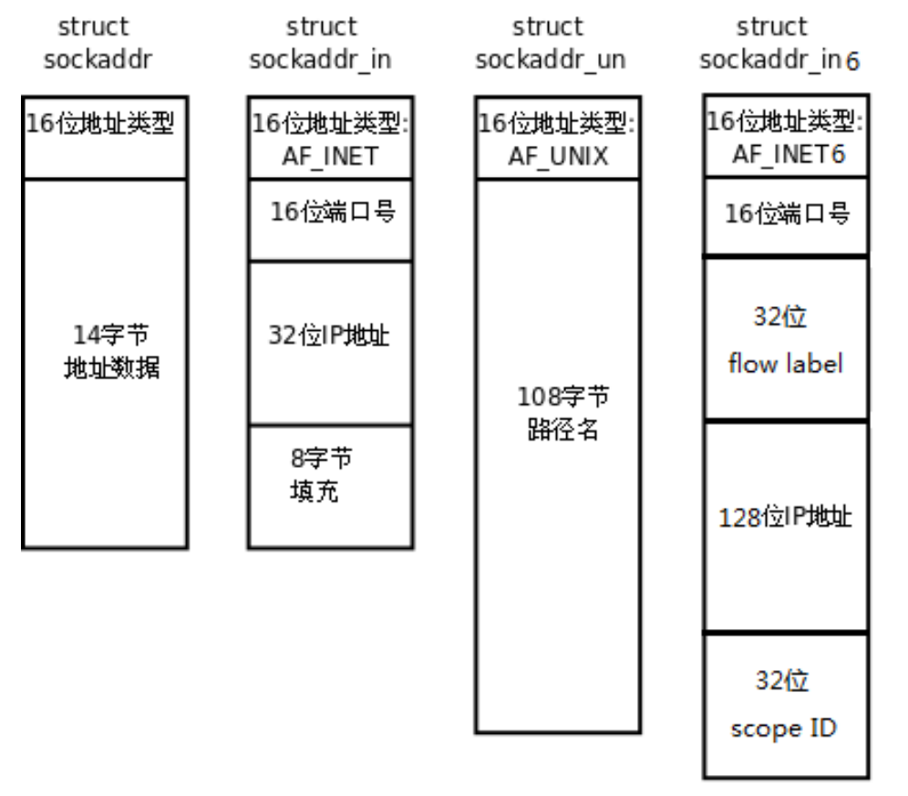
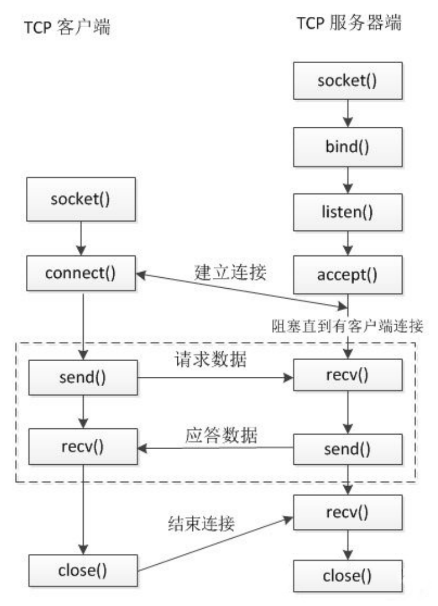
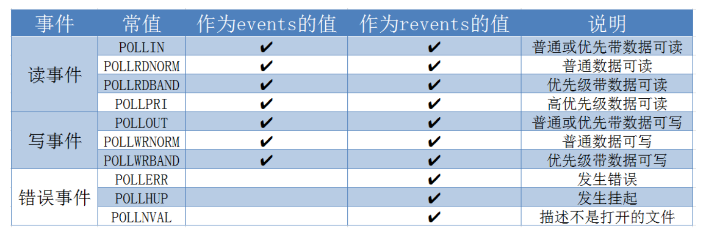
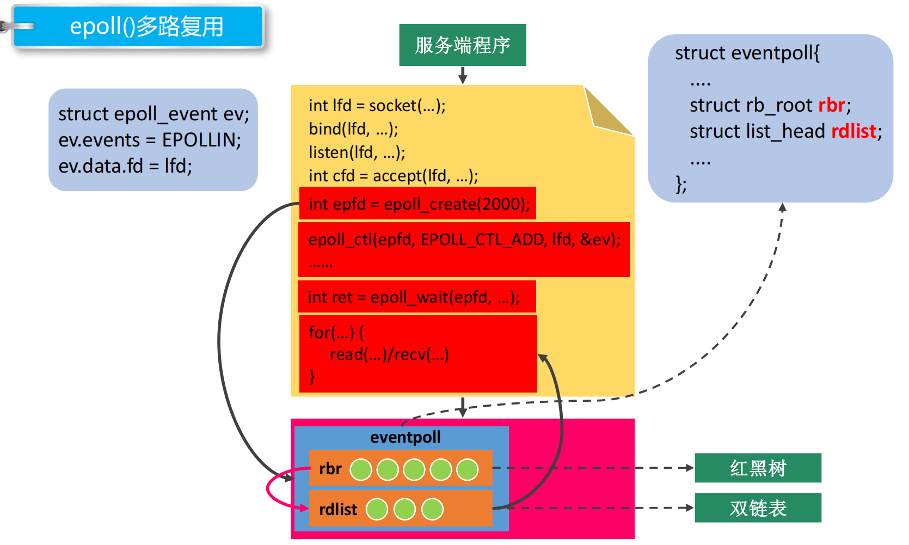
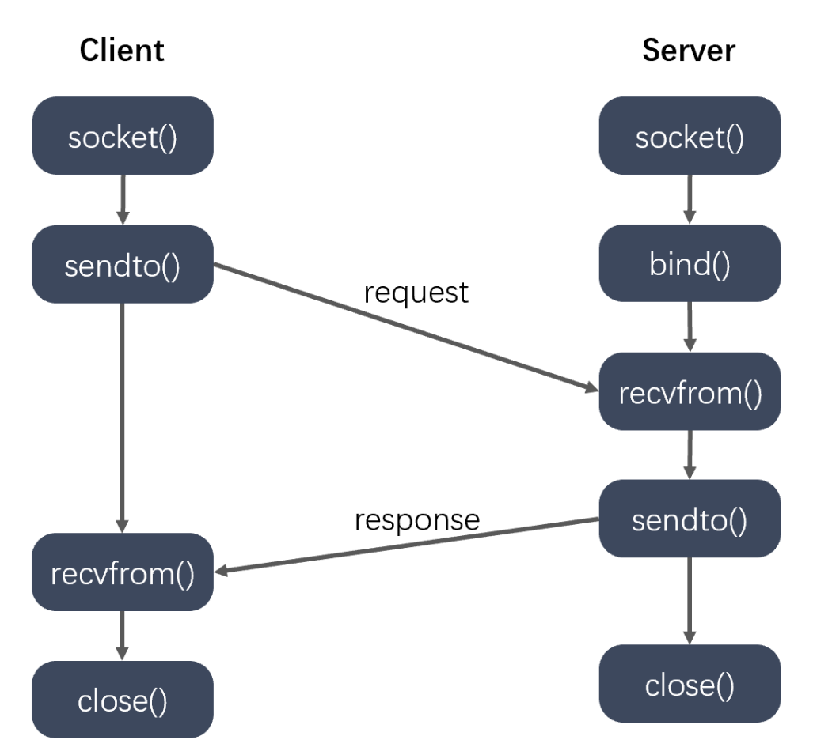

# 1. socket简介

socket(套接字)是对网络中不同主机上的应用进程之间进行双向通信的端点的抽象。一个套接字就是网络上进程通信的一端，提供了应用层进程利用网络协议交换数据的机制。从所处的地位来讲，套接字上联应用进程，下联网络协议栈，是应用程序通过网络协议进行通信的接口。

socket可以看作是两个网络应用程序进行通信时，各自通信连接中的端点，是一个逻辑上的概念。它是网络环境中进程间通信的API，也是可以被命名和寻址的通信端点，使用中的每一个套接字都有其类型和一个与之相连的进程。通信时其中一个网络应用程序将要传输的数据写入它所在主机的socket中，该socket通过与网卡相连的传输介质将这些数据送到另外一台主机的socket中，使对方能够接收到这些数据。socket是由IP地址和端口结合的，提供向应用层进程传送数据包的机制。

在Linux环境下，socket用于表示进程间网络通信的特殊文件类型，本质是内核借助缓冲区形成的伪文件。所以我们可以使用文件描述符引用套接字。与管道类似，Linux系统将其封装成文件的目的是为了统一接口，使得读写套接字和读写文件的操作一致。区别是管道主要用于本地进程间通信，而套接字主要用于网络进程间通信。套接字通信分为两端，其中服务器端被动接受连接，一般不会主动发起连接，而客户端则主动向服务器发起连接。

# 2. 字节序

在各种计算机体系结构中，对于字节的存储机制有所不同。字节序，即字节的顺序，就是大于一个字节类型的数据在内存中的存放顺序。分为大端字节序和小端字节序：
- 大端字节序：一个整数的高位字节存储在内存的低地址处，低位字节存储在内存的高地址处。
- 小端字节序：一个整数的高位字节存储在内存的高地址处，低位字节存储在内存的低地址处。

例如从左至右为内存地址增长的方向，那么数0x01020304用大端存储即为0x01020304，而用小端存储即为0x04030201

## 字节序转换函数

当格式化的数据在两台使用不同字节序的主机之间直接传递时，接收端必然错误地解释之。为此，发送端应把要发送的数据转换成大端字节序数据后再发送，而接收端知道对方传送过来的数据总是采用大端字节序，所以接收端可以根据自身采用的字节序决定是否对接收到的数据进行转换。

网络字节顺序是TCP/IP中规定好的一种数据表示格式，它与具体的CPU类型、操作系统等无关，从而可以保证数据在不同主机之间传输时能够被正确解释，网络字节顺序采用大端字节序。

BSD Socket提供了封装好的转换接口，包括从主机字节序到网络字节序的转换函数：htons、htonl，以及从网络字节序到主机字节序的转换函数：ntohs、ntohl。其中h表示host(主机)，n表示network(网络)。

```c
#include <arpa/inet.h>
//以下两个函数一般用于转换端口
uint16_t htons(uint16_t hostshort);
uint16_t ntohs(uint16_t netshort);
//以下两个函数一般用于转换IP
uint32_t htonl(uint32_t hostlong);
uint32_t ntohl(uint32_t netlong);
```

# 3. socket地址

socket地址是一个结构体，封装端口号和IP等信息。与socket相关的API会用到这个socket地址。

## 通用socket地址

socket网络编程接口中表示socket地址的是结构体sockaddr，其定义如下：
```c
#include <bits/socket.h>
struct sockaddr {
    sa_family_t sa_family;
    char sa_data[14];
};
typedef unsigned short int sa_family_t;
```

sa_family成员是地址族类型(sa_family_t)的变量。地址族类型通常与协议族类型对应。常见的协议族(protocol family，也称domain)和对应的地址族如下所示：

|协议族|地址族|描述|
|---|---|---|
|PF_UNIX|AF_UNIX|UNIX本地域协议族|
|PF_INET|AF_INET|TCP/IPv4协议族|
|PF_INET6|AF_INET6|TCP/IPv6协议族|

宏PF_\*和AF_\*都定义在bits/socket.h头文件中，且两者有完全相同的值，所以两者经常混用。

sa_data成员用于存放socket地址值。但是不同的协议族的地址值具有不同的含义和长度，如下所示：

|协议族|地址值含义和长度|
|---|---|
|PF_UNIX|文件的路径名，长度可达到108字节|
|PF_INET|16bit端口号和32bit IPv4地址，共6字节|
|PF_INET6|16bit端口号，32bit流标识，128bit IPv6地址，32bit范围ID，共26字节|

由上表可知，14字节的sa_data根本无法容纳多数协议族的地址值。因此，Linux定义了下面这个新的通用的socket地址结构体，这个结构体不仅提供了足够大的空间用于存放地址值，而且是内存对齐的。

```c
#include <bits/socket.h>
struct sockaddr_storage {
    sa_family_t sa_family;
    unsigned long int __ss_align;
    char __ss_padding[ 128 - sizeof(__ss_align) ];
};
typedef unsigned short int sa_family_t;
```

## 专用socket地址

很多网络编程函数诞生早于IPv4协议，那时候都使用的是 struct sockaddr结构体，为了向前兼容，现在sockaddr退化成了（void *）的作用，传递一个地址给函数，至于这个函数是sockaddr_in还是sockaddr_in6，由地址族确定，然后函数内部再强制类型转化为所需的地址类型。



UNIX本地域协议族使用如下专用的socket地址结构体：
```c
#include <sys/un.h>
struct sockaddr_un {
    sa_family_t sin_family;
    char sun_path[108];
};
```

TCP/IP协议族有sockaddr_in和sockaddr_in6两个专用的socket地址结构体，它们分别用于IPv4和IPv6：
```c
#include <netinet/in.h>
struct sockaddr_in {
    sa_family_t sin_family; /* __SOCKADDR_COMMON(sin_) */
    in_port_t sin_port; /* Port number. */
    struct in_addr sin_addr; /* Internet address. */
    /* Pad to size of `struct sockaddr'. */
    unsigned char sin_zero[sizeof (struct sockaddr) - __SOCKADDR_COMMON_SIZE -
                sizeof (in_port_t) - sizeof (struct in_addr)];
};

struct in_addr {
    in_addr_t s_addr;
};

struct sockaddr_in6 {
    sa_family_t sin6_family;
    in_port_t sin6_port; /* Transport layer port # */
    uint32_t sin6_flowinfo; /* IPv6 flow information */
    struct in6_addr sin6_addr; /* IPv6 address */
    uint32_t sin6_scope_id; /* IPv6 scope-id */
};

typedef unsigned short uint16_t;
typedef unsigned int uint32_t;
typedef uint16_t in_port_t;
typedef uint32_t in_addr_t;
#define __SOCKADDR_COMMON_SIZE (sizeof (unsigned short int))
```

所有专用socket地址（以及sockaddr_storage）类型的变量在实际使用时都需要转化为通用socket地址类型sockaddr（强制转化即可），因为所有socket编程接口使用的地址参数类型都是sockaddr。

# 4. IP地址转换

通常，人们习惯用可读性好的字符串来表示 IP 地址，比如用点分十进制字符串表示 IPv4 地址，以及用十六进制字符串表示 IPv6 地址。但编程中我们需要先把它们转化为整数（二进制数）方能使用。而记录日志时则相反，我们要把整数表示的 IP 地址转化为可读的字符串。下面 3 个函数可用于用点分十进制字符串表示的 IPv4 地址和用网络字节序整数表示的 IPv4 地址之间的转换：
```c
#include <arpa/inet.h>
in_addr_t inet_addr(const char *cp);
int inet_aton(const char *cp, struct in_addr *inp);
char *inet_ntoa(struct in_addr in);
```

下面这对更新的函数也能完成前面 3 个函数同样的功能，即将IP地址字符串与网络字节序的整数进行转换，并且它们同时适用 IPv4 地址和 IPv6 地址：
```c
#include <arpa/inet.h>
// p表示点分十进制的IP字符串，n表示network，即网络字节序的整数
int inet_pton(int af, const char *src, void *dst);
/*
    - af表示地址族，可选AF_INET或AF_INET6
    - src表示需要转换的点分十进制的IP字符串
    - dst用于存放转换后的结果
*/

const char *inet_ntop(int af, const void *src, char *dst, socklen_t size);
/*
    - af表示地址族，可选AF_INET或AF_INET6
    - src是要转换的网络字节序的整数的地址
    - dst用于存放转换成IP地址的字符串
    - size指明第三个参数的大小（数组的大小）
    - 返回值：返回转换后的字符串的地址，和dst相同
*/
```

# 5. TCP通信流程

服务器端：

1. 创建一个用于监听的套接字，来监听客户端的连接。这个套接字其实就是一个文件描述符。
2. 将这个监听文件描述符和本地的IP和端口绑定（IP和端口就是服务器的地址信息）。客户端连接服务器的时候使用的就是这个IP和端口。
3. 设置监听，监听套接字开始工作。
4. 阻塞等待，当有客户端发起连接，解除阻塞，接受客户端的连接，然后得到一个和客户端通信的新的套接字。
5. 通信(接收数据和发送数据)。
6. 通信结束，断开连接。

客户端：

1. 创建一个用于通信的套接字
2. 连接服务器，需要指定连接的服务器的IP和端口
3. 连接成功后，客户端可以直接和服务器通信(接收数据和发送数据)
4. 通信结束，断开连接



# 6. socket函数

```c
#include <sys/types.h>
#include <sys/socket.h>
#include <arpa/inet.h> //包含了这个头文件，上面两个就可以省略
```

```c
int socket(int domain, int type, int protocol);
```
- 功能：创建一个套接字
- 参数：
  - domain: 协议族。AF_INET表示ipv4；AF_INET6表示ipv6；AF_UNIX或AF_LOCAL表示本地套接字通信（即本地进程间通信）
  - type: 通信过程中使用的协议类型。SOCK_STREAM表示流式协议，SOCK_DGRAM表示报式协议
  - protocol: 具体的一个协议，一般传入0表示默认。type为SOCK_STREAM时默认协议是TCP，SOCK_DGRAM时默认协议是UDP
- 返回值：成功则返回文件描述符，操作的就是内核缓冲区；失败返回-1

```c
int bind(int sockfd, const struct sockaddr *addr,
                socklen_t addrlen);
```
- 功能：绑定，将fd和本地的IP+端口进行绑定，也称为socket命名
- 参数：
  - sockfd : 通过socket()函数得到的文件描述符
  - addr : 需要绑定的socket地址，这个地址封装了ip和端口号的信息
  - addrlen : 第二个参数结构体占的内存大小
- 返回值：成功返回0，失败返回-1

```c
int listen(int sockfd, int backlog);
```
- 功能：监听这个socket上的连接
- 参数：
  - sockfd : 通过socket()函数得到的文件描述符
  - backlog : 未连接的和已经连接的和的最大值，一般传入5即可，最大上限可在/proc/sys/net/core/somaxconn文件中查看
- 返回值：成功返回0，失败返回-1

```c
int accept(int sockfd, struct sockaddr *addr, socklen_t *addrlen);
```
- 功能：接收客户端连接，默认是一个阻塞的函数，阻塞等待客户端连接
- 参数：
  - sockfd : 用于监听的文件描述符
  - addr : 传出参数，记录了连接成功后客户端的地址信息（ip，port）
  - addrlen : 指定第二个参数的对应的内存大小
- 返回值：成功则返回用于通信的文件描述符，失败返回-1

```c
int connect(int sockfd, const struct sockaddr *addr,
                   socklen_t addrlen);
```
- 功能：客户端连接服务器
- 参数：
  - sockfd : 用于通信的文件描述符
  - addr : 客户端要连接的服务器的地址信息
  - addrlen : 第二个参数的内存大小
- 返回值：成功返回0，失败返回-1

```c
ssize_t write(int fd, const void *buf, size_t count); //写数据
ssize_t read(int fd, void *buf, size_t count); //读数据
```

```c
int shutdown(int sockfd, int how);
```
- 功能：用于控制半关闭状态的API
- 参数：sockfd是需要关闭的socket的描述符; how有以下几个值：
  - SHUT_RD(0)：关闭sockfd上的读功能，此选项将不允许sockfd进行读操作。该套接字不再接收数据，任何当前在套接字接受缓冲区的数据将被无声的丢弃掉。
  - SHUT_WR(1): 关闭sockfd的写功能，此选项将不允许sockfd进行写操作。进程不能再对此套接字进行写操作。
  - SHUT_RDWR(2): 关闭sockfd的读写功能。相当于调用shutdown两次, 首先是以SHUT_RD, 然后以SHUT_WR。

使用 close 中止一个连接，但它只是减少描述符的引用计数，并不直接关闭连接，只有当描述符的引用计数为 0 时才关闭连接。shutdown 不考虑描述符的引用计数，直接关闭描述符，也可选择中止一个方向的连接，只中止读或只中止写。

注：如果有多个进程共享一个套接字，close 每被调用一次，计数减 1 ，直到计数为 0 时，也就是所用进程都调用了 close，套接字将被释放，即如果一个进程调用 close(sfd) 将不会影响到其它进程。但在多进程中如果一个进程调用了 shutdown(sfd, SHUT_RDWR) 后，其它的进程将无法进行通信。

# 7. 端口复用

端口复用最常用的用途是：防止服务器重启时之前绑定的端口还未释放；程序突然退出而系统没有释放端口。

```c
int setsockopt(int sockfd, int level, int optname,
              const void *optval, socklen_t optlen);
```
- 功能：设置套接字的属性，比如端口复用。注意设置端口复用必须在服务器绑定端口之前。
- 参数：
  - sockfd: 套接字描述符
  - level: 级别(SOL_SOCKET是端口复用的级别)
  - optname: 选项名称，SO_REUSEADDR表示地址复用，SO_REUSEPORT表示端口复用
  - optval: 指向端口复用的值(整型)，1表示可以复用，0表示不可以复用
  - optlen: optval指向的参数大小

例：使用端口复用
```c
int val = 1;
setsockopt(sfd, SOL_SOCKET, SO_REUSEPORT, &val, sizeof(val));
```

查看网络相关信息的命令：netstat, 参数：
- -a: 显示所有的socket
- -p: 显示正在使用socket的程序的名称
- -n: 直接使用IP地址，而不通过域名服务器

# 8. I/O多路复用

I/O多路复用也称为I/O多路转接，能够使程序同时监听多个文件描述符，提高程序的性能，Linux下实现I/O多路复用的系统调用主要有select、poll和epoll。

## BIO模型

阻塞等待I/O的优点是阻塞进程不会占用CPU的宝贵时间，缺点是同一时刻只能处理一个操作，效率太低。为此采用多进程或者多线程来解决，每个线程/进程对应一个client，这样做也会有一定的缺点，比如线程或进程会占用系统资源，且线程或进程调度会消耗CPU资源。

## NIO模型

非阻塞I/O采用的是忙轮询的方式，即每隔一定时间进行询问，其优点是提高了程序的运行效率，缺点是需要占用更多的CPU和系统资源。如果有n个client，每次询问需要O(n)次系统调用，为此我们使用了I/O多路转接技术：第一种是select/poll，它委托内核进行询问，但只会返回读缓冲区内有数据的client数量；第二种是epoll，它同样委托内核进行询问，但会返回读缓冲区内有数据的client数量以及对应client的socket描述符。

# 9. select

思想：

1. 首先要构造一个关于文件描述符的列表，将要监听的文件描述符添加到该列表中。
2. 调用系统函数select，监听该列表中的文件描述符，直到这些描述符中的一个或者多个进行I/O操作时，该函数才返回。
   - 这个函数是阻塞
   - 函数对文件描述符的检测的操作是由内核完成的
3. 在返回时，它会告诉进程有多少（哪些）描述符进行I/O操作。

```c
#include <sys/select.h>
#include <sys/time.h>
#include <sys/types.h>
#include <unistd.h>

int select(int nfds, fd_set *readfds, fd_set *writefds,
          fd_set *exceptfds, struct timeval *timeout);
```
- 参数：
  - nfds : 委托内核检测的最大文件描述符的值+1
  - readfds : 要检测的文件描述符的读缓冲区的集合，委托内核检测哪些文件描述符的读缓冲区的属性，即检测该文件描述符的读缓冲区内是否有对方发过来的数据。fd_set是一个结构体，含有1024 bit，每一位对应一个文件描述符，即采用类似位图的方式。
  - writefds : 要检测的文件描述符的写缓冲区的集合，委托内核检测哪些文件描述符的写缓冲区的属性，即检测哪些文件描述符的写缓冲区还可以写数据(即写缓冲区未满)
  - exceptfds : 检测发生异常的文件描述符的集合
  - timeout : 用于设置超时时间。结构体timeval有两个成员，其中long tv_sec表示秒，long tv_usec表示微秒。
    - NULL表示永久阻塞，直到检测到了文件描述符的对应缓冲区有变化
    - tv_sec = 0 且 tv_usec = 0 表示不阻塞
    - tv_sec > 0 或 tv_usec > 0 表示阻塞对应的时间
- 返回值：失败返回-1，成功则返回一个正整数n，表示检测的集合中有n个文件描述符发生了变化，如果返回0则表示超时时间到了且检测集合中的文件描述符没有变化(所以如果设置永久阻塞，就不可能返回0)

```c
// 将参数文件描述符fd对应的标志位设置为0
void FD_CLR(int fd, fd_set *set);
// 返回fd对应的标志位的值(1或0)
int  FD_ISSET(int fd, fd_set *set);
// 将参数文件描述符fd对应的标志位设置为1
void FD_SET(int fd, fd_set *set);
// fd_set一共有1024 bit, 全部初始化为0
void FD_ZERO(fd_set *set);
```

select的缺点：
- 每次调用select，都需要把fd集合从用户态拷贝到内核态，这个开销在fd很多时会很大
- 每次调用select都需要在内核遍历传递进来的所有fd，这个开销在fd很多时也很大
- select支持的文件描述符数量太小了，默认是1024
- fds集合不能重用，每次都需要重置

# 10. poll

```c
#include <poll.h>
struct pollfd {
    int   fd;      //委托内核检测的文件描述符
    short events;  //委托内核检测文件描述符的事件
    short revents; //文件描述符实际发生的事件
};
int poll(struct pollfd *fds, nfds_t nfds, int timeout);
```
- 参数：
  - fds : 是一个struct pollfd结构体数组，这是一个需要检测的文件描述符的集合
  - nfds : 是第一个参数数组中最后一个有效元素的下标+1
  - timeout : 阻塞时长。0表示不阻塞; -1表示阻塞，当需要检测的文件描述符有变化时解除阻塞; 大于0表示阻塞的时长，单位是毫秒
- 返回值：失败返回-1，成功则返回一个正整数n，表示检测的集合中有n个文件描述符发生了变化，如果返回0则表示超时时间到了且检测集合中的文件描述符没有变化(所以如果设置永久阻塞，就不可能返回0)



# 11. epoll



```c
#include <sys/epoll.h>

int epoll_create(int size);
```
- 功能：在内核中创建一个新的epoll实例，该实例中有两个比较重要的数据，一个是需要检测的文件描述符的信息(红黑树实现)，还有一个是就绪列表，存放检测到数据发生改变的文件描述符信息(双向链表实现)。
- 参数：如今已经没有意义了，只需传入任意一个大于0的数即可
- 返回值：失败返回-1，成功则返回一个文件描述符(大于0的值)，用于操作epoll实例

```c
typedef union epoll_data {
    void        *ptr;
    int          fd;
    uint32_t     u32;
    uint64_t     u64;
} epoll_data_t;

struct epoll_event {
    uint32_t     events;      /* Epoll events */
    epoll_data_t data;        /* User data variable */
};
//常见的epoll检测事件events有EPOLLIN、EPOLLOUT、EPOLLERR、EPOLLET(用于设置ET模式)

int epoll_ctl(int epfd, int op, int fd, struct epoll_event *event);
```
- 功能：对epoll实例进行管理，如添加文件描述符信息、删除信息、修改信息等
- 参数：
  - epfd：epoll实例对应的文件描述符
  - op：操作，如EPOLL_CTL_ADD(添加)、EPOLL_CTL_MOD(修改)、EPOLL_CTL_DEL(删除)
  - fd：要操作的文件描述符
  - event：检测文件描述符的什么事件
- 返回值：成功返回0，失败返回-1

```c
int epoll_wait(int epfd, struct epoll_event *events,
              int maxevents, int timeout);
```
- 功能：检测文件描述符
- 参数：
  - epfd：epoll实例对应的文件描述符
  - events：传出参数，保存了发生了变化的文件描述符的信息
  - maxevents：第二个参数结构体数组的大小
  - timeout：阻塞时长。0表示不阻塞; -1表示阻塞，当需要检测的文件描述符有变化时解除阻塞; 大于0表示阻塞的时长，单位是毫秒
- 返回值：失败返回-1，成功则返回一个正整数n，表示检测的集合中有n个文件描述符发生了变化，如果返回0则表示超时时间到了且检测集合中的文件描述符没有变化(所以如果设置永久阻塞，就不可能返回0)


epoll的两种工作模式：

- LT模式(水平触发)：LT(level-triggered)是默认的工作方式，并且同时支持block和no-block socket。在这种模式中，内核告诉你一个文件描述符是否就绪了，然后你可以对这个就绪的fd进行IO操作。如果你不作任何操作，内核还是会继续通知你的。例如，假设委托内核检测fd的读缓冲区，则epoll首次检测到读缓冲区有数据就会通知用户，如果用户不读数据或者只读了一部分数据，那么epoll会继续通知用户，直到读完了数据后才不会再通知。
- ET模式(边缘触发)：ET(edge-triggered)是高速工作方式，只支持 no-block socket。在这种模式下，当描述符从未就绪变为就绪时，内核通过epoll告诉你，然后它会假设你知道文件描述符已经就绪，并且不会再为那个文件描述符发送更多的就绪通知，直到你做了某些操作导致那个文件描述符不再为就绪状态了。但是请注意，如果一直不对这个fd作IO操作，内核不会发送更多的通知。例如，假设委托内核检测fd的读缓冲区，则epoll首次检测到读缓冲区有数据就会通知用户，如果用户不读数据或者只读了一部分数据，那么epoll都不会继续通知用户。ET模式在很大程度上减少了epoll事件被重复触发的次数，因此效率要比LT模式高，epoll工作在ET模式的时候，必须使用非阻塞接口，以避免由于一个文件描述符的阻塞读/阻塞写操作把处理多个文件描述符的任务饿死。


# 12. UDP通信



```c
#include <sys/types.h>
#include <sys/socket.h>

ssize_t sendto(int sockfd, const void *buf, size_t len, int flags,
            const struct sockaddr *dest_addr, socklen_t addrlen);
```
- 参数：
  - sockfd : 通信的fd
  - buf : 要发送的数据
  - len : 发送数据的长度
  - flags : 一般传入0即可
  - dest_addr : 通信的另外一端的地址信息
  - addrlen : dest_addr所占的内存大小
- 返回值：成功则返回发送的字节数，失败返回-1

```c
ssize_t recvfrom(int sockfd, void *buf, size_t len, int flags,
            struct sockaddr *src_addr, socklen_t *addrlen);
```
- 参数：
  - sockfd : 通信的fd
  - buf : 接收数据的数组
  - len : 数组的大小
  - flags : 一般传入0即可
  - src_addr : 用来保存另外一端的地址信息，不需要可以指定为NULL
  - addrlen : src_addr所占的内存大小
- 返回值：成功则返回接收的字节数，失败返回-1

# 13. 广播

向子网中多台计算机发送消息，并且子网中所有的计算机都可以接收到发送方发送的消息，每个广播消息都包含一个特殊的IP地址，这个IP中子网内主机标志部分的二进制全部为1。注意广播只能在局域网中使用，且客户端需要绑定服务器广播使用的端口，才可以接收到广播消息。

我们可以用第7节介绍的函数setsockopt来设置一个套接字为广播属性：
```c
int val = 1;
setsockopt(sfd, SOL_SOCKET, SO_BROADCAST, &val, sizeof(val));
```

# 14. 组播(多播)

单播地址标识单个 IP 接口，广播地址标识某个子网的所有 IP 接口，多播地址标识一组 IP 接口。单播和广播是寻址方案的两个极端（要么单个要么全部），多播则意在两者之间提供一种折中方案。多播数据报只应该由对它感兴趣的接口接收，也就是说由运行相应多播会话应用系统的主机上的接口接收。另外，广播一般局限于局域网内使用，而多播则既可以用于局域网，也可以跨广域网使用。注意客户端需要加入多播组，才能接收到多播的数据。

IP 多播通信必须依赖于 IP 多播地址，在 IPv4 中它的范围从 224.0.0.0 到 239.255.255.255，并被划分为局部链接多播地址、预留多播地址和管理权限多播地址三类:

|IP地址|说明|
|---|---|
|224.0.0.0~224.0.0.255|局部链接多播地址：是为路由协议和其它用途保留的地址，路由器并不转发属于此范围的IP包|
|224.0.1.0~224.0.1.255|预留多播地址：公用组播地址，可用于Internet；使用前需要申请|
|224.0.2.0~238.255.255.255|预留多播地址：用户可用组播地址(临时组地址)，全网范围内有效|
|239.0.0.0~239.255.255.255|本地管理组播地址，可供组织内部使用，类似于私有 IP 地址，不能用于 Internet，可限制多播范围|

我们同样可以用setsockopt函数来设置组播
```c
int setsockopt(int sockfd, int level, int optname,
              const void *optval, socklen_t optlen);
```
- 服务器设置多播的信息，外出接口：
  - level : IPPROTO_IP
  - optname : IP_MULTICAST_IF
  - optval : struct in_addr\*
- 客户端加入到多播组：
  - level : IPPROTO_IP
  - optname : IP_ADD_MEMBERSHIP
  - optval : struct ip_mreq\*

其中
```c
struct ip_mreq {
    struct in_addr imr_multiaddr; // 组播的IP地址
    struct in_addr imr_interface; // 本地的IP地址
};

typedef uint32_t in_addr_t;
struct in_addr {
    in_addr_t s_addr;
};
```

# 15. 本地套接字

本地套接字用于本地进程间通信，实现流程与网络套接字类似，一般采用TCP通信流程。

```c
#include <sys/un.h>
#define UNIX_PATH_MAX 108
struct sockaddr_un {
    sa_family_t sun_family; // 地址族协议AF_LOCAL
    char sun_path[UNIX_PATH_MAX]; //套接字文件的路径, 这是一个伪文件, 大小永远=0
};
```

服务器端流程：
1.创建监听的套接字
```c
int lfd = socket(AF_LOCAL, SOCK_STREAM, 0);
```
2.监听的套接字绑定本地的套接字文件(server端)
```c
struct sockaddr_un addr;
bind(lfd, (struct sockaddr *)&addr, sizeof(addr));
// 绑定成功之后，指定的sun_path中的套接字文件会自动生成。
```
3.监听
```c
listen(lfd, 100);
```
4.等待并接受连接请求
```c
struct sockaddr_un cliaddr;
int len = sizeof(cliaddr);
int cfd = accept(lfd, (struct sockaddr *)&cliaddr, &len);
```
5.通信：接收数据read/recv，发送数据write/send
6.关闭连接close()

客户端流程：
1.创建通信的套接字
```c
int fd = socket(AF_LOCAL, SOCK_STREAM, 0);
```
2.绑定本地套接字文件(client端)
```c
struct sockaddr_un addr;
bind(fd, (struct sockaddr *)&addr, sizeof(addr));
```
3.连接服务器
```c
struct sockaddr_un seraddr;
connect(fd, (struct sockaddr *)&seraddr, sizeof(seraddr));
```
4.通信：接收数据read/recv，发送数据write/send
5.关闭连接close()
